# ARCHITECTURE.md — CoachOS

> **This file owns the *shape* of the system: what the pieces are, how they are wired,
> and how a request, a byte, or an event travels through them.**
>
> It does not own product decisions (`CLAUDE.md`), persisted state (`DATABASE.md`),
> build order (`.claude/plan/`), or house style (`.claude/skills/`). Where this file
> and one of those disagree, the more specific document wins for its own domain and
> **this file is the bug** — fix it in the same PR.
>
> Its companion, **`ARCHITECTURE-ESSENTIALS.md`**, lists the load-bearing pieces of
> this architecture: the ones whose absence breaks the product or quietly ruins the
> experience. Read that one before deciding what to cut under time pressure.

---

## A§0. How to read this file

| If you want to know… | Go to |
|---|---|
| What the system is made of, at a glance | A§2 (context), A§3 (containers) |
| Where the code for a thing lives | A§5 (mobile), A§6 (API) |
| Where a piece of data lives and who owns it | A§7, then `DATABASE.md` DB§1.1 |
| How a specific operation actually works, end to end | A§8 (the seven critical flows) |
| Why a coach can't see another coach's client | A§9 |
| What happens when Redis / R2 / the network dies | A§12 |
| What we are allowed to change, and what we are not | A§14 |

**Diagram convention.** Solid arrows are synchronous calls. Dashed arrows are
asynchronous (queue, webhook, push). Dotted arrows are policy or gating relationships,
not data flow.

---

## A§1. The five architectural commitments

Everything below follows from these. Each one was chosen deliberately and each one has
a cost we accepted knowingly.

**1. One codebase, two apps, one API.**
Coach and client ship from a single Expo project with role-based routing, and talk to a
single tRPC API. *Cost:* every screen must consider two roles. *Benefit:* one type
system end to end, one release pipeline, no drift between two half-maintained clients.

**2. The device is a first-class replica, not a cache.**
A client in a gym basement can log a complete 60-minute session with no network at all.
The mobile app has its own SQLite database, its own write path, and a durable outbox.
*Cost:* the sync contract (`DATABASE.md` DB§14) is the hardest code in the product.
*Benefit:* the core loop never blocks on the network — which is the difference between a
tool a client uses and one they abandon.

**3. Postgres is the only durable truth we own.**
Redis is ephemeral. R2 holds bytes we can lose without losing the business. Every
external system (RevenueCat, LiveKit, PostHog) is either a replica or a one-way sink.
*Cost:* one database to scale carefully. *Benefit:* recovery has one story
(`DATABASE.md` DB§20), and no fact is authoritative in two places.

**4. Authorisation is middleware, never a line inside a procedure.**
Three ordered checks — authenticated, correct role, owns the resource — applied by
composition. *Cost:* a slightly heavier procedure-definition ceremony. *Benefit:* the
single most likely catastrophic bug in this product (coach A reading coach B's client)
is testable by enumeration rather than by reading every handler.

**5. One process until it hurts.**
Phase 1 runs the API, the WebSocket gateway, the job workers, and ffmpeg in one
container next to one Postgres and one Redis. The seams to split it are drawn (A§13)
but not cut. *Cost:* a CPU-heavy transcode can degrade API latency. *Benefit:* $0/month,
one deploy, one log stream — and the seams mean the split is a config change, not a
rewrite.

---

## A§2. System context

Who and what CoachOS talks to. Nothing inside the box is drawn yet.

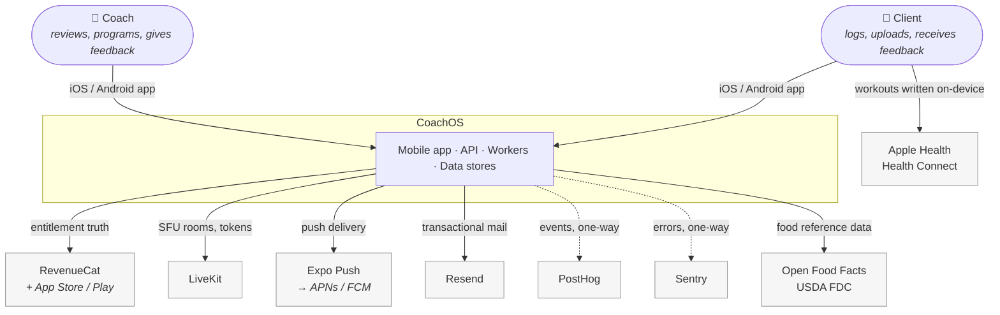

**Read the last edge carefully.** Health integration is a *device-local export*: the app
writes completed workouts into Apple Health / Health Connect on the phone. It never
travels through our API and we never store health data read back from those services.
See A§8.7 and `.claude/plan/phase-24-health-sync/`.

### A§2.1 What each external system is authoritative for

| System | Authoritative for | Our copy is | If it is down |
|---|---|---|---|
| **RevenueCat** (+ stores) | Subscription entitlement | A replica in `coach_profiles`, reconciled on foreground | We serve the last known entitlement; grace logic (§15.7) absorbs it |
| **LiveKit** | Live room state, participants | `live_sessions` metadata only — never rebuilt from our DB | Live sessions unavailable; everything else works |
| **Expo Push → APNs/FCM** | Delivery of a notification | `notifications` rows are the durable record | In-app inbox still shows everything; only the interrupt is lost |
| **PostHog / Sentry** | Nothing we read back | One-way sink | No user-visible effect. Ever. |
| **Open Food Facts / USDA** | Public food reference data | Cached permanently in `foods` on first use | Cached foods still searchable; new lookups fail softly |
| **Apple Health / Health Connect** | The client's own health record | Nothing. We write, we do not read | Export queues on-device and retries |

---

## A§3. Container view

The pieces that run, and the wires between them.

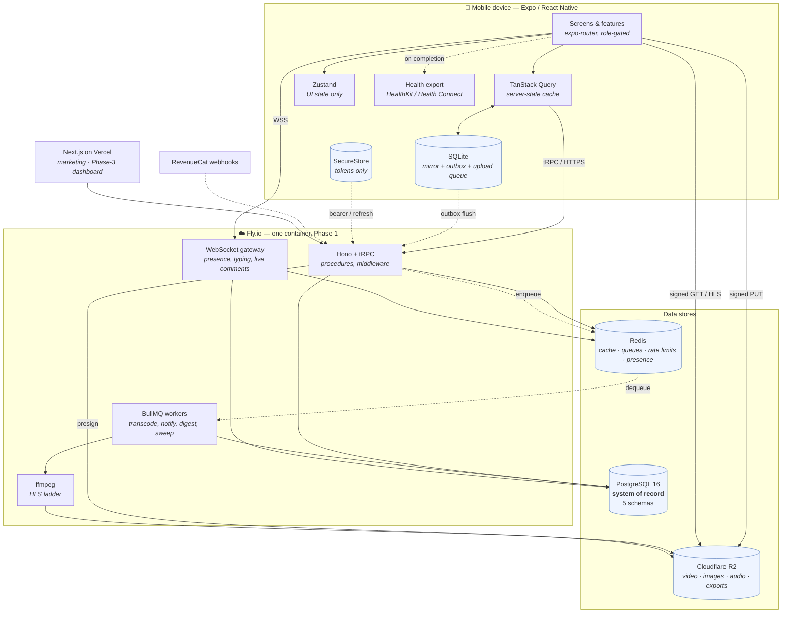

### A§3.1 Container responsibilities

| Container | Owns | Explicitly does not |
|---|---|---|
| **Mobile app** | All UI, the offline write path, the local mirror, media capture & upload, health export | Touch Postgres directly. Decide entitlement. Hold secrets. |
| **API (Hono + tRPC)** | Authn/authz, validation, business rules, presigning, entitlement computation, webhook intake | Do CPU-heavy work inline. Trust any client-supplied limit or flag. |
| **WebSocket gateway** | Presence, typing, live comment fanout | Be the delivery guarantee for anything. Every realtime event has a durable counterpart in Postgres. |
| **Workers (BullMQ)** | Transcode, notification fanout, digests, check-in scheduling, retention sweeps, webhook processing, AI generation | Be the only place a job can originate — every job is re-enqueueable from Postgres state. |
| **Postgres** | Every durable relational fact | Store bytes. Store ephemeral state. |
| **Redis** | Cache, queues, counters, presence, locks | Hold the only copy of anything (`DATABASE.md` DB§15) |
| **R2** | Media bytes and export archives | Be publicly readable. Ever. |
| **Web (Next.js)** | Marketing, legal pages, Phase-3 coach dashboard | Exist for clients in v1 (`CLAUDE.md` §1.2) |

---

## A§4. Deployment topology

### A§4.1 Phase 1 — everything on free tiers, one box

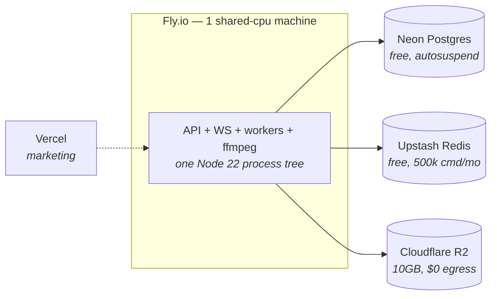

Ceiling: **$0/month** (`CLAUDE.md` §3.4.2). The only unavoidable spend is the two
developer-program fees.

### A§4.2 The split, in the order it should happen

Each step is triggered by a measurement, not a date. Do not pre-split.

| # | Trigger | Split | Why this order |
|---|---|---|---|
| 1 | ffmpeg CPU starves API p95 latency | Move the **transcode worker** to its own cheap VPS | Transcode is the only genuinely CPU-bound workload; it is also the easiest to move (it talks only to Redis, Postgres, R2) |
| 2 | Neon free tier storage or autosuspend hurts | Self-host **Postgres** on a Hetzner CX22 (~€4/mo) | Cheaper than every managed upgrade tier (`CLAUDE.md` §3.4.3) |
| 3 | Upstash command budget exceeded | Run **Redis** in the same box as the API | It is one process; managed Redis buys us nothing at this size |
| 4 | LiveKit Cloud free minutes exceeded | Self-host the **LiveKit SFU** | This is why LiveKit was chosen over Agora/Twilio |
| 5 | WS connection count destabilises the API process | Split the **WebSocket gateway** | Long-lived connections and request/response have different failure and scaling shapes |

**Not on this list, deliberately:** splitting the API into services. The five Postgres
schemas are the extraction seam if that day ever comes (A§13); it is not close.

---

## A§5. Mobile app architecture

### A§5.1 Layers

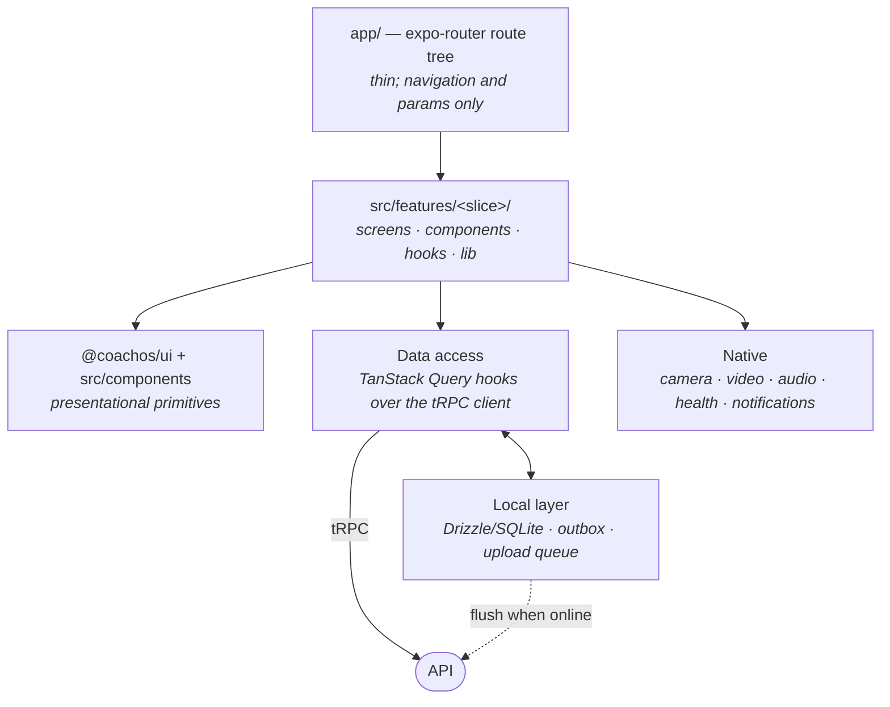

**Rules that keep this from rotting** (full text in the `code-conventions` skill):

- Routes are thin. A route file resolves params and renders a feature screen. Business
  logic in `app/` is a smell.
- A feature slice is vertical: it owns its screens, its components, its hooks, and its
  local helpers. A component used by two slices is promoted to `packages/ui`.
- **Server state is TanStack Query. UI state is Zustand.** There is no third option and
  no global store of server data. The rest timer and the in-progress logger draft are
  Zustand; everything else is Query.
- `packages/utils` is pure functions only — no React, no Node built-ins — because both
  the app and the API import it. Seat-limit derivation, adherence, 1RM, and unit
  conversion live there so the two sides cannot disagree.

### A§5.2 Role divergence

One app, two experiences, resolved by route groups plus a `role` check — never by
forking a component.

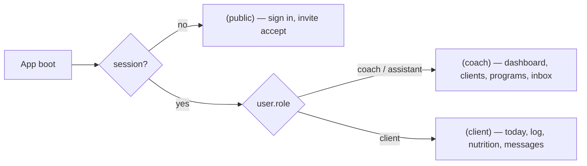

Assistant coaches (Phase 3) render the coach tree; what differs is *which clients
resolve*, which is an authorisation concern (A§9), not a navigation one.

### A§5.3 The local write path

The single most important design property of the client app: **a user action never
awaits the network.**

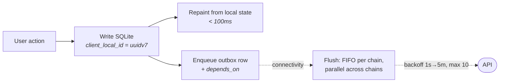

`client_local_id` is generated **once**, at the moment of the action, and never
regenerated on retry. That single rule is what makes double-flush safe.

---

## A§6. API architecture

### A§6.1 The layer cake

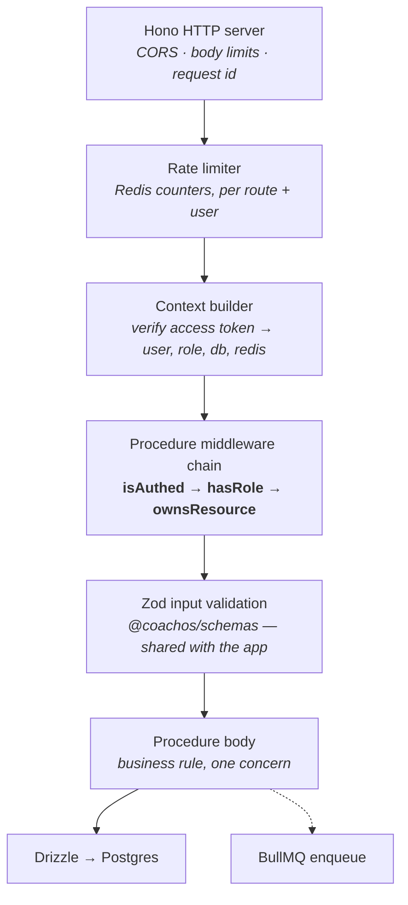

**Order matters and is not negotiable.** Rate limiting precedes token verification so an
unauthenticated flood is cheap to reject. Authorisation precedes validation so an
unauthorised caller learns nothing from error shapes. Validation precedes the body so no
procedure ever sees an unparsed input.

### A§6.2 Router layout

Routers mirror the domain, not the database. One router per coherent surface; procedure
names are verbs.

```
appRouter
├── auth            signUp · signIn · refresh · signOut · deleteAccount
├── coach           profile · dashboard · clients · notes
├── client          profile · intake · today
├── invites         create · accept · revoke
├── exercises       list · search · create
├── programs        create · update · duplicate · assign · templates
├── workouts        session · logSet · complete · history        ← offline-capable
├── nutrition       search · scan · logMeal · targets · summary   ← offline-capable
├── media           presign · complete · asset · retention
├── comments        create · list · react                          ← offline-capable
├── checkins        template · schedule · submit · review
├── messages        conversations · send · read                    ← offline-capable
├── live            createRoom · token · end
├── notifications   list · read · preferences · registerDevice
├── billing         entitlements · products · restore
└── ai              summary · progression · replyDraft             (Phase 3)
```

Everything marked *offline-capable* accepts and honours `clientLocalId`, and has a
`UNIQUE (owner, client_local_id)` index behind it. That list and that index set must
stay in sync — see `ARCHITECTURE-ESSENTIALS.md` E§1.

### A§6.3 Where work goes

| Kind of work | Runs | Rule |
|---|---|---|
| Reads a client already waits on | Inline, in the procedure | Must fit the A§12 latency budget |
| Writes the user is watching | Inline, one transaction | Optimistic on the device; the server confirms |
| Anything over ~200ms that nobody is watching | BullMQ job | Enqueue inside the same transaction's commit path, never before it |
| Anything CPU-bound | BullMQ job, always | ffmpeg never runs in a request |
| Anything that calls a third party that can be slow | BullMQ job | A slow Resend or Expo Push must never hold a request open |

---

## A§7. Data architecture

### A§7.1 Five stores, five jobs

`DATABASE.md` DB§1 is the authority; this is the shape of it.

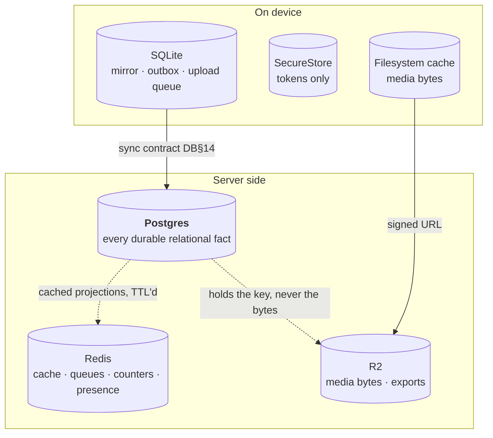

**The recovery corollary, verbatim from DB§1.1:** if Redis is wiped, the system
recovers. If R2 is wiped, media is gone but the app works. If Postgres is wiped, the
company is gone.

### A§7.2 Postgres schema map

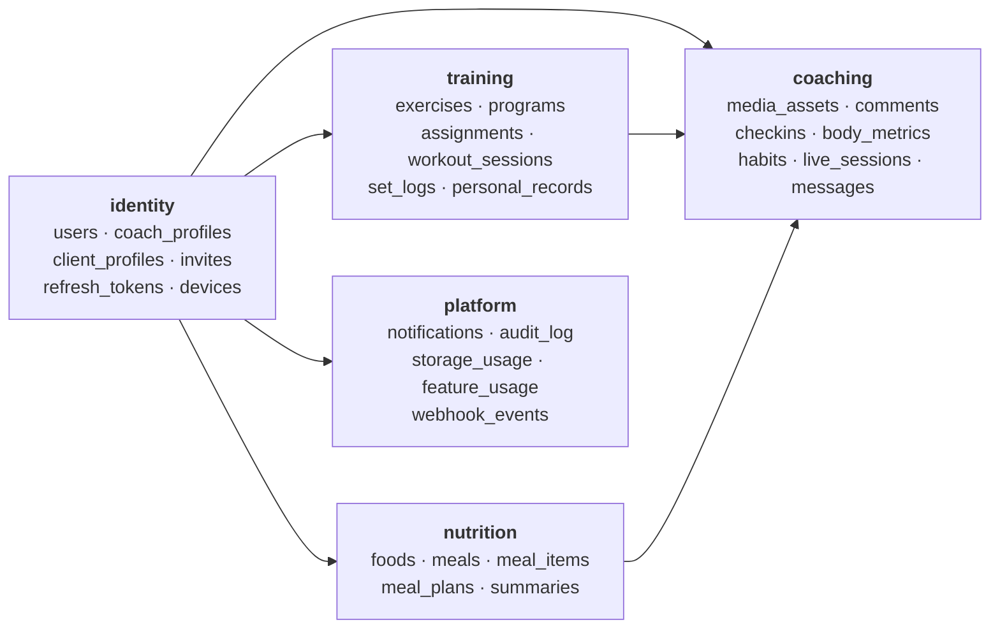

`identity` is upstream of everything: it holds the coach↔client edge that every
authorisation decision resolves against. `platform` is downstream of everything: it
observes, it is never observed.

### A§7.3 Denormalisation for authorisation

Coach-addressable leaf tables carry a denormalised `coach_id` / `client_id`, set on
INSERT only. This is not a performance micro-optimisation — it is what makes
`ownsResource` a single indexed predicate instead of a three-table join on the hot path
of every request. See `DATABASE.md` DB§6.

---

## A§8. Critical flows

Seven flows carry essentially all of the product's risk. Each is drawn once, here.

### A§8.1 An authenticated request, with token refresh

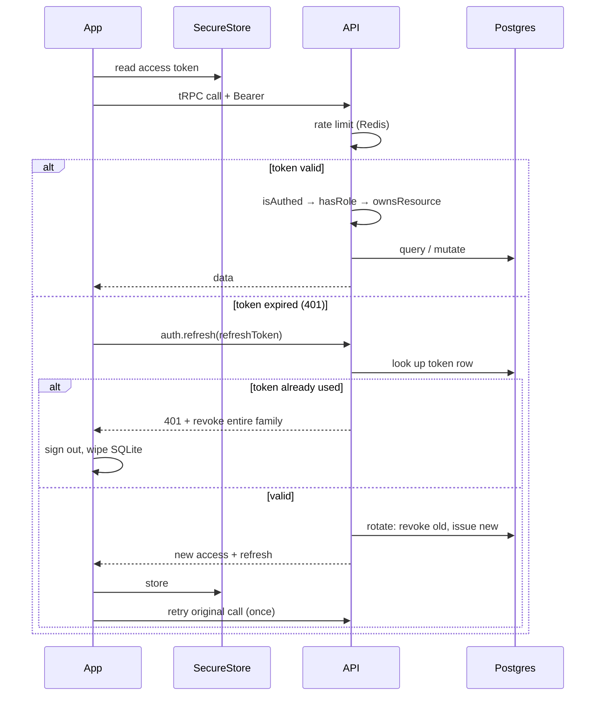

**Reuse detection is the point.** A refresh token presented twice means it was stolen;
the whole family is revoked and the user is signed out. The retry is attempted exactly
once — a refresh loop is a worse failure than a sign-out.

### A§8.2 Offline write and outbox flush

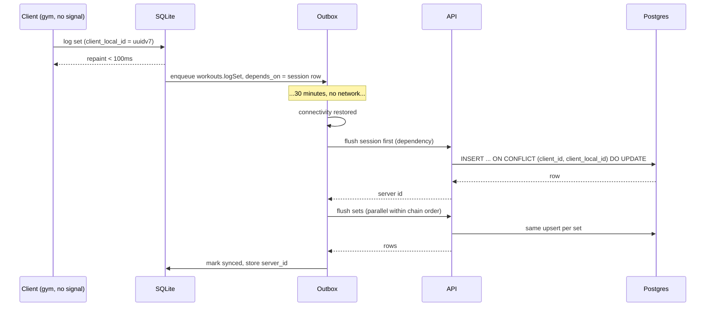

Three properties make this safe, and all three are load-bearing:

1. **Idempotency** — the unique index on `(owner, client_local_id)` turns a replay into
   an update. Ten flushes, one row, ten identical responses.
2. **Ordering** — `depends_on` guarantees a set never arrives before its session.
3. **Bounded retry** — 1s→5min backoff, 10 attempts, then a visible "couldn't sync —
   retry", never a silent drop.

### A§8.3 Media: upload → transcode → playback

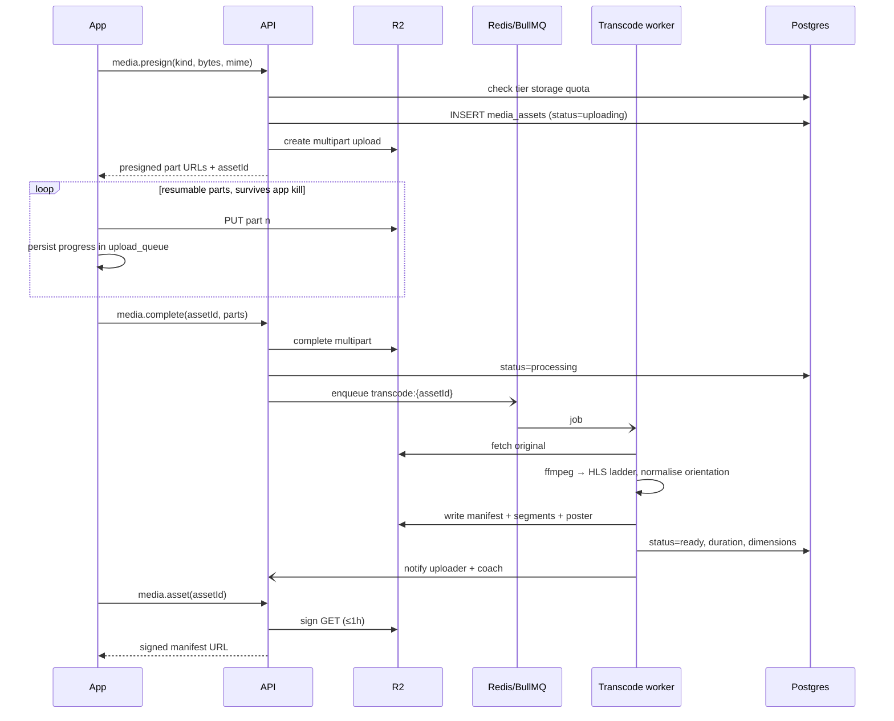

Two details that are easy to get wrong and expensive to fix later: the **quota check
happens before the presign**, not after the bytes land (otherwise a coach can exceed
their plan and we pay for it), and **orientation is normalised during transcode**,
because iOS and Android disagree and annotations drawn on a rotated video land in the
wrong place (`CLAUDE.md` §25.10).

### A§8.4 Realtime

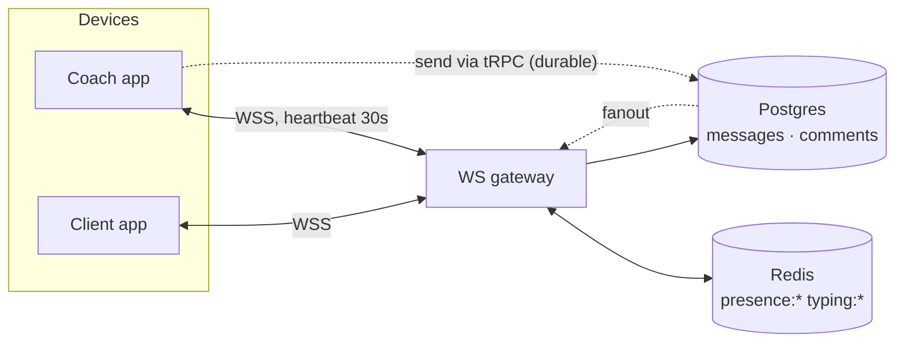

**The WebSocket is an accelerant, not a transport of record.** A message is sent over
tRPC and written to Postgres; the socket delivers it *faster*. If the socket is down,
the message still sends and still arrives on the next poll or foreground. Presence and
typing are the only things that exist solely in Redis, and losing them is invisible.

### A§8.5 Billing and entitlement

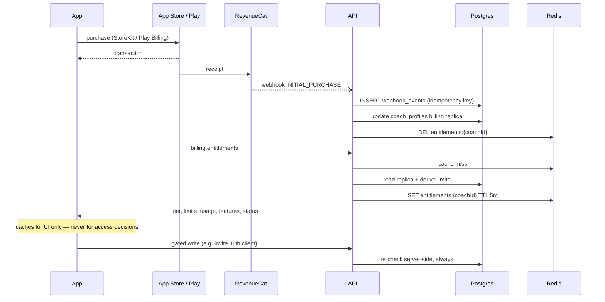

Three non-negotiables live in this flow: webhooks are **neither ordered nor
exactly-once** so the handler is idempotent against a `webhook_events` ledger; the app
**reconciles against RevenueCat's REST API on every foreground** because a missed
webhook must self-heal; and the client **never decides access** — a patched app unlocks
nothing.

### A§8.6 Notification → deep link

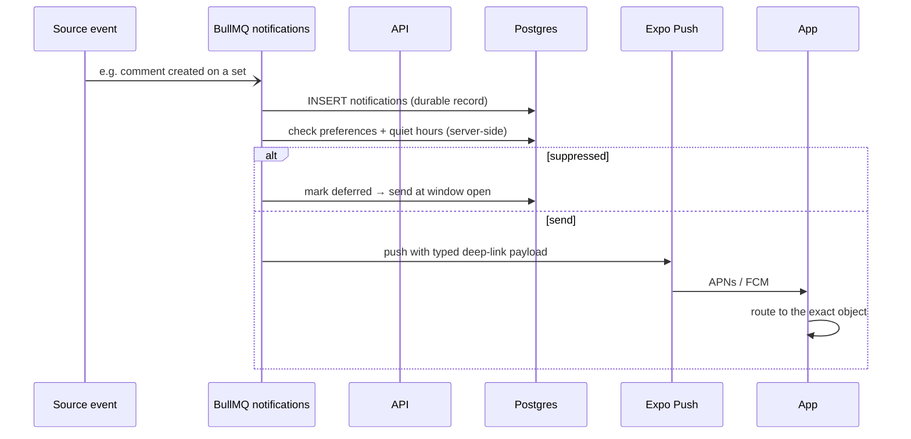

Quiet hours are enforced **server-side**, at fanout, in the recipient's timezone. A
client-side filter would still buzz the phone at 2am.

### A§8.7 Health sync — completed workout → Apple Health / Health Connect

The one flow that deliberately does not involve the server.

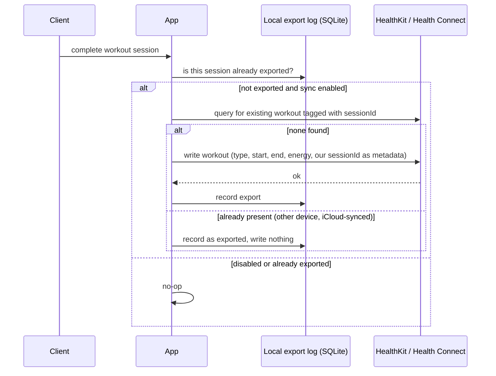

Design constraints, all deliberate:

- **Write-only.** We request write scopes only. We never read health data back, so no
  health data ever enters Postgres, an AI prompt, an analytics event, or a log.
- **No server state.** The toggle and the export log live in device SQLite. Revoking
  consent is an OS-level action plus a local wipe — there is nothing on our side to purge.
- **Idempotent across devices.** The metadata tag plus a pre-write query is what stops
  iCloud-synced Health from accumulating duplicate workouts when a client uses two
  devices.
- **Never gated.** This is a client-experienced feature, and `CLAUDE.md` §15.4 forbids
  gating anything the client experiences.

---

## A§9. Authorisation architecture

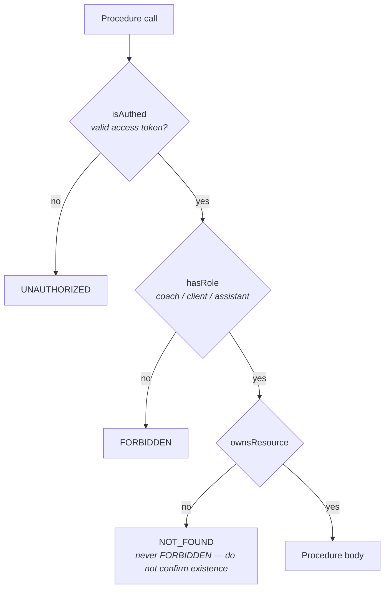

### A§9.1 What `ownsResource` actually resolves

| Caller | May touch |
|---|---|
| Client | Rows where `client_id` = their own profile |
| Root coach | Rows where `coach_id` = them, **or** `coach_id` ∈ their assistants |
| Assistant coach | Rows where `coach_id` = them. Never the root's own clients, never a sibling's |

The assistant case is one extra indexed lookup (`parent_coach_id`), not a hierarchy
walk, and it is an amendment to the existing per-resource conditions — not a fourth
check. Until Phase 3 ships, every coach has zero assistants and the condition degrades
to exactly the two-row case above.

**The enumeration test is part of the architecture, not the test suite.** It walks every
registered procedure and fails the build if one takes a `clientId` without passing
through `ownsResource`. New procedures are covered automatically or explicitly
allowlisted with a written reason.

---

## A§10. Background job architecture

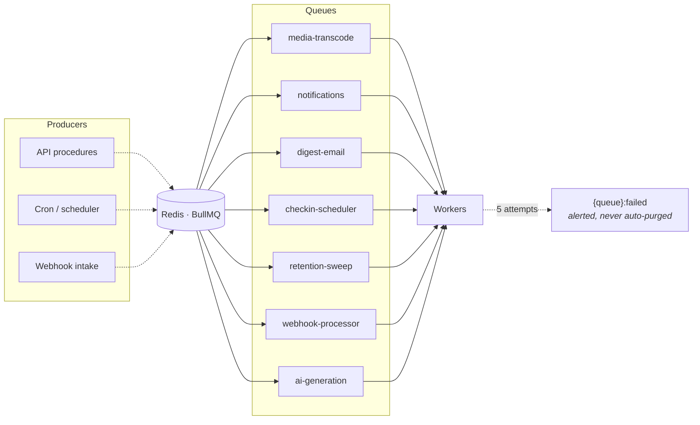

**Every job is idempotent and carries a derived `jobId`** (`transcode:{assetId}`,
`digest:{coachId}:{isoWeek}`) so re-enqueueing is always safe. Every job must also be
reconstructible from Postgres state — if Redis is lost, a sweep re-enqueues the work.
That property is what lets us treat Redis as genuinely disposable.

---

## A§11. Caching architecture

Four layers, each with a different invalidation story. Confusing them is how stale data
reaches a coach.

| Layer | Holds | Invalidated by | If it is wrong |
|---|---|---|---|
| **TanStack Query** (device, memory + persisted) | Server responses | Mutation `invalidateQueries`, refetch on foreground | Stale UI until refocus |
| **SQLite mirror** (device, durable) | Last 30d + today's working set | Sync engine on flush and prefetch | Client sees old data offline — acceptable, by design |
| **Redis** (server, TTL'd) | `entitlements` 5m · `dash` 60s · `food:q` 24h · `signedurl` 55m | TTL, plus explicit `DEL` on the mutations that matter (entitlement change, dashboard-affecting write) | A coach sees a 60s-old dashboard, or a just-upgraded coach waits ≤5m for a UI limit to move — never for *access*, which is re-checked live |
| **HTTP / CDN** | Nothing authenticated. Marketing site only | Deploy | — |

**Signed URL TTLs are a cache with teeth.** The Redis entry (55m) is deliberately shorter
than the R2 signature (1h) so a cached URL is never handed out after it has expired.

---

## A§12. Failure modes and degradation

What a user actually experiences when a piece is missing. This table is the reason
`ARCHITECTURE-ESSENTIALS.md` exists.

| Failure | Blast radius | Degradation | Recovery |
|---|---|---|---|
| **No network on client device** | One client | Full logging, viewing cached program, drafting comments. Nothing blocks. | Outbox flushes on reconnect |
| **Redis down** | All users | Rate limits fail **closed** on auth, **open** on reads; dashboards recompute live (slower); presence/typing vanish; jobs stop being *consumed* | Restart; re-enqueue sweeps recover pending work |
| **R2 down / unreachable** | All media | Video and photos fail to load with an explicit retry state; uploads queue on device | Automatic; upload queue survives app kill |
| **Transcode worker down** | New videos | Assets sit at `processing` with an honest "still processing" state; playback of existing HLS unaffected | Queue drains on restart |
| **Postgres down** | Everything server-side | App runs read-only from the SQLite mirror; every write queues | Restore per DB§20 |
| **RevenueCat webhook missed** | One coach's billing | Entitlement stale up to next foreground | Foreground reconciliation against the REST API |
| **LiveKit down** | Live sessions only | Cannot join/start; scheduled sessions show an error state | External |
| **Expo Push down** | Notification interrupts | In-app inbox still correct; the buzz is lost | Notifications remain durable rows |
| **API deployed with a bad migration** | Everything | — | This is the one with no graceful degradation. See `ARCHITECTURE-ESSENTIALS.md` E§9 |

### A§12.1 Latency budgets that shape the architecture

These are `CLAUDE.md` §19's numbers, restated here because several architectural choices
exist only to hit them.

| Path | Budget | What buys it |
|---|---|---|
| Set log → visual confirmation | < 100ms | Local-first write (A§5.3) |
| Dashboard, cached | < 200ms | Redis `dash:{coachId}` |
| Dashboard, network | < 800ms p75 | Denormalised `coach_id`, materialised summaries |
| Food search keystroke | < 400ms | `food:q:{hash}` cache + local top-200 mirror |
| Video first frame | < 1.5s | HLS ladder, poster frame, `expo-video` |
| Live join | < 3s on 4G | LiveKit token minted ahead of the join |

---

## A§13. Extraction seams

If this ever needs to be more than one service, these are the cut lines that were drawn
in advance. **Do not cut them early.**

| Seam | Where it already exists | What a cut would cost |
|---|---|---|
| Transcode | Its own queue, talks only to Redis/PG/R2 | Nearly nothing. Cut first. |
| WebSocket gateway | Separate entry point, shares only Redis + PG | Session/auth sharing; modest |
| Postgres schemas | `identity` / `training` / `nutrition` / `coaching` / `platform` | Cross-schema FKs become application-level joins. Expensive. Last resort. |
| Web dashboard | Already a separate Next.js app on Vercel | Already cut |

The five schemas are the seam because they were named for the feature slices from the
start — each could become its own database without renaming a single table.

---

## A§14. Architecture invariants

Numbered so a review can cite them. Violating one is a blocking review comment, not a
preference.

**AI-1.** The mobile app never touches Postgres. All reads and writes go through the API.

**AI-2.** Every procedure taking a `clientId` passes through `ownsResource`, applied as
middleware, never inline.

**AI-3.** Every offline-writable table has `client_local_id` and a `UNIQUE (owner,
client_local_id)` index. The index is load-bearing.

**AI-4.** `client_local_id` is generated once on the device, at the moment of the user's
action, and never regenerated on retry.

**AI-5.** No fact is authoritative in two stores. Replicas are labelled as replicas
(`DATABASE.md` DB§1.1).

**AI-6.** Redis may never hold the only copy of anything.

**AI-7.** The R2 bucket has no public access. Every read is a signed URL, ≤ 1 hour.

**AI-8.** Entitlement is computed server-side on every gated write. The client's cached
copy renders UI and decides nothing.

**AI-9.** No CPU-bound work runs inside a request. ffmpeg is always a job.

**AI-10.** Every job is idempotent, carries a subject-derived `jobId`, and is
reconstructible from Postgres state.

**AI-11.** A training day is a local calendar date, not a timestamp. Day-boundary logic
resolves in the *client's* timezone.

**AI-12.** Units live in identifiers. A variable named `weight` is a bug; `weightKg` is
not.

**AI-13.** Sensitive data (progress photos, body metrics, injuries, food logs, form
video) never enters logs, analytics, exports, or AI prompts.

**AI-14.** Realtime is an accelerant. Every realtime event has a durable Postgres
counterpart, and the product works — slower — with the socket permanently down.

**AI-15.** Health integration is write-only and device-local. No health data read from
Apple Health or Health Connect is ever transmitted to or stored on our servers.

**AI-16.** No new dependency without a `CLAUDE.md` §3 entry; no new paid service without
passing §3.4.1.

---

## A§15. Amending this file

Change it in the same PR as the code that changed the shape of the system. Specifically:

- **Adding a container, a queue, or an external service** → A§2/A§3 diagrams, A§2.1 or
  A§10, plus the `CLAUDE.md` §3 stack table.
- **Adding a flow that crosses three or more containers** → a sequence diagram in A§8.
  Two containers does not earn a diagram.
- **Changing a cache TTL or adding a cache** → A§11.
- **Adding a way the system can fail** → A§12, and check whether it belongs in
  `ARCHITECTURE-ESSENTIALS.md`.
- **Anything that would make an invariant in A§14 false** → that is not a documentation
  change, that is a decision. Open an entry in `CLAUDE.md` §27 first.

---

*Companion: `ARCHITECTURE-ESSENTIALS.md` · Owner: Ammar · Last updated: 16 August 2026*
