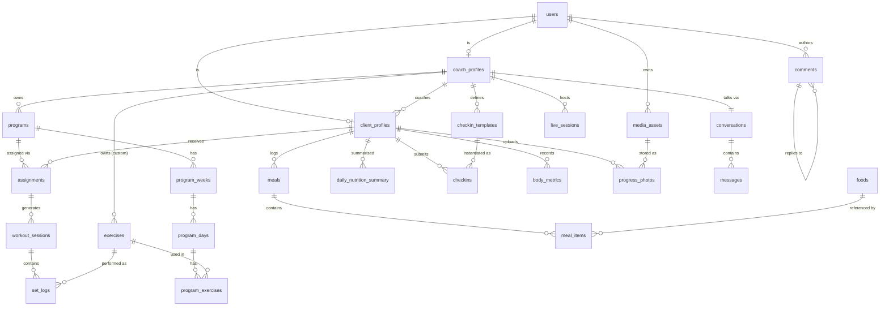

# DATABASE.md — CoachOS

> **Companion to `CLAUDE.md`.** That file owns product and architecture decisions;
> this file owns every byte of persisted state. §-references point back to `CLAUDE.md`
> unless prefixed `DB§`.
>
> **Rule:** no table, column, key, or bucket path exists in this project unless it
> exists in this file first. If code and this file disagree, fix both in the same PR.

---

## DB§1. The data store map

CoachOS persists state in **five** places. They are not interchangeable, and each has
exactly one job.

```
┌─────────────────────────────────────────────────────────────────────┐
│                          MOBILE DEVICE                              │
│  ┌──────────────────────────┐   ┌───────────────────────────────┐   │
│  │ SQLite (expo-sqlite)     │   │ SecureStore (expo-secure-store│   │
│  │ • offline mirror         │   │ • access / refresh tokens ONLY│   │
│  │ • outbox (mutation queue)│   └───────────────────────────────┘   │
│  │ • TanStack Query cache   │                                       │
│  └────────────┬─────────────┘                                       │
└───────────────┼─────────────────────────────────────────────────────┘
                │ tRPC over HTTPS (never direct DB access)
┌───────────────▼─────────────────────────────────────────────────────┐
│                            API SERVER                               │
│   ┌──────────────────┐  ┌───────────────┐  ┌────────────────────┐   │
│   │ PostgreSQL 16    │  │ Redis         │  │ Cloudflare R2      │   │
│   │ SYSTEM OF RECORD │  │ ephemeral     │  │ blobs              │   │
│   │ all durable      │  │ cache, queues,│  │ video, images,     │   │
│   │ relational data  │  │ rate limits,  │  │ audio, exports     │   │
│   │                  │  │ presence      │  │                    │   │
│   └──────────────────┘  └───────────────┘  └────────────────────┘   │
└─────────────────────────────────────────────────────────────────────┘
                │
   ┌────────────┴──────────────┬──────────────┬─────────────────┐
   ▼                           ▼              ▼                 ▼
RevenueCat                 LiveKit         PostHog        Open Food Facts
(billing truth)         (room state)     (analytics)      (food data)
```

### DB§1.1 Source-of-truth matrix

The single most important table in this file. **Never store the same fact
authoritatively in two places.**

| Data | System of record | Cached where | Notes |
|---|---|---|---|
| Users, profiles, relationships | **Postgres** | SQLite (current user only) | |
| Programs, sessions, set logs | **Postgres** | SQLite (last 30d + today) | |
| Meals, foods, nutrition | **Postgres** | SQLite (recent + top 100 foods) | |
| Comments, messages | **Postgres** | SQLite (last 30d) | |
| Media **metadata** | **Postgres** (`media_assets`) | — | |
| Media **bytes** | **R2** | device filesystem cache | Postgres stores the key, never the bytes |
| Subscription entitlement | **RevenueCat** | Postgres (`coach_profiles`) | Postgres is a *replica*; reconcile on foreground (§15.7) |
| Live room state | **LiveKit** | Postgres (`live_sessions` metadata only) | Ephemeral; never rebuild from our DB |
| Analytics events | **PostHog** | — | Never queried by the app. One-way. |
| Food reference data | **Open Food Facts / USDA** | Postgres (`foods`) | Cached permanently on first use |
| Job queues | **Redis** | — | Lost jobs are re-enqueueable from Postgres state |
| Sessions/tokens | **Postgres** (`refresh_tokens`) | SecureStore | |

**Corollary:** if Redis is wiped, the system recovers. If R2 is wiped, media is gone
but the app works. If Postgres is wiped, the company is gone. Back up accordingly
(DB§20).

---

## DB§2. PostgreSQL — conventions

Every one of these is non-negotiable and enforced in review.

| Rule | Detail |
|---|---|
| **Primary keys** | `uuid`, generated **app-side as UUIDv7** (time-ordered → sequential index inserts, far better locality than v4). DB default `gen_random_uuid()` exists only as a safety net. |
| **Naming** | `snake_case`. Tables plural (`set_logs`). Join tables `a_b`. FKs `<singular>_id`. |
| **Timestamps** | `timestamptz` always, stored UTC. Never `timestamp`. Never store an offset separately. |
| **Calendar dates** | `date` for a *user's local calendar day* (`scheduled_date`, `logged_date`). This distinction is the #1 source of bugs in fitness apps (§17.4). |
| **Units in column names** | Mandatory: `weight_kg`, `height_cm`, `duration_seconds`, `sodium_mg`, `timestamp_ms`. A column named `weight` is a bug. |
| **Money** | Never stored. Billing lives in RevenueCat/Stripe. |
| **Decimals** | `numeric(p,s)` for anything a human reads. **Never `float`** for weights, macros, or measurements. |
| **Booleans** | `not null default false`, named `is_/has_/can_`. |
| **Soft delete** | `deleted_at timestamptz null`. Every query filters it. Partial indexes assume it. |
| **Audit columns** | `created_at`, `updated_at` on every table, `updated_at` maintained by trigger (DB§8.1). |
| **Text** | `text` always. Never `varchar(n)` — length limits belong in Zod (§6.4), not the DB. |
| **Arrays** | `text[]` is fine for small, unindexed, non-relational lists (`specialties`, `cues`). Anything queried or joined gets a real table. |
| **JSONB** | Allowed **only** for genuinely schemaless payloads: `checkins.responses`, `checkin_templates.fields`, `comments.annotation`, `client_profiles.injuries`, `notifications.data`, `audit_log.metadata`. Every other use is a modelling failure. |
| **Enums** | Native `CREATE TYPE`. See caveat in DB§4. |
| **Cascades** | `ON DELETE CASCADE` only where the child is meaningless alone (`set_logs` → `workout_sessions`). Everything else `ON DELETE RESTRICT`. Never `SET NULL` on a required relationship. |
| **Constraints** | If a rule can be expressed as a `CHECK`, it is a `CHECK`. Application validation is a convenience, not a guarantee. |

### DB§2.1 Extensions

```sql
CREATE EXTENSION IF NOT EXISTS "pgcrypto";    -- gen_random_uuid()
CREATE EXTENSION IF NOT EXISTS "citext";      -- case-insensitive email
CREATE EXTENSION IF NOT EXISTS "pg_trgm";     -- fuzzy food & exercise search
CREATE EXTENSION IF NOT EXISTS "btree_gin";   -- composite GIN indexes
```

No PostGIS, no TimescaleDB, no pgvector. If you think you need one, open a decision in
§27 first.

---

## DB§3. Schema organisation

One database, **five schemas**, mirroring the feature slices. This is the "extraction
seam" referenced in the microservices decision — each schema could become its own
database later without renaming anything.

```
identity   users, auth_providers, coach_profiles, client_profiles, coach_client_notes,
           refresh_tokens, invites, devices
training   exercises, programs, program_weeks, program_days, program_exercises,
           assignments, workout_sessions, set_logs, personal_records
nutrition  foods, meals, meal_items, meal_plans, meal_plan_days, meal_plan_items,
           meal_plan_assignments, daily_nutrition_summary, water_logs
coaching   media_assets, comments, reactions, checkin_templates, checkins,
           body_metrics, progress_photos, habits, habit_logs, blocks, reports,
           live_sessions, live_session_participants, conversations, messages
platform   notifications, notification_preferences, audit_log, storage_usage,
           feature_usage, webhook_events, moderation_actions, export_requests
```

`search_path = identity, training, nutrition, coaching, platform, public`.

**Cross-schema FKs are allowed** (it is one database). Cross-schema *joins in a hot
query* are a smell — denormalise instead (DB§6).

---

## DB§4. Enums

```sql
CREATE TYPE user_role            AS ENUM ('coach','client','assistant');
CREATE TYPE subscription_tier    AS ENUM ('starter','coach','pro','studio','agency');
CREATE TYPE subscription_status  AS ENUM ('trialing','active','grace','paused','expired','refunded');
CREATE TYPE billing_platform     AS ENUM ('app_store','play_store','stripe','manual');
CREATE TYPE client_status        AS ENUM ('invited','active','paused','archived');
CREATE TYPE training_goal        AS ENUM ('fat_loss','muscle_gain','performance','health','other');
CREATE TYPE experience_level     AS ENUM ('beginner','intermediate','advanced');
CREATE TYPE movement_pattern     AS ENUM ('squat','hinge','push','pull','carry','core','isolation','other');
CREATE TYPE session_status       AS ENUM ('scheduled','in_progress','completed','skipped');
CREATE TYPE assignment_status    AS ENUM ('active','completed','paused','cancelled');
CREATE TYPE meal_type            AS ENUM ('breakfast','lunch','dinner','snack','pre_workout','post_workout');
CREATE TYPE food_source          AS ENUM ('openfoodfacts','usda','coach','client','verified');
CREATE TYPE media_kind           AS ENUM ('video','image','audio','document');
CREATE TYPE media_status         AS ENUM ('uploading','processing','ready','failed','deleted');
CREATE TYPE media_visibility     AS ENUM ('coach_only','shared','private');
CREATE TYPE comment_target       AS ENUM ('workout_session','set_log','meal','media_asset','checkin','program_day','body_metric');
CREATE TYPE checkin_status       AS ENUM ('pending','submitted','reviewed','missed');
CREATE TYPE checkin_cadence      AS ENUM ('weekly','biweekly','monthly');
CREATE TYPE live_session_kind    AS ENUM ('checkin_call','live_workout','group');
CREATE TYPE photo_angle          AS ENUM ('front','side','back','custom');
CREATE TYPE metric_source        AS ENUM ('manual','checkin','coach');
CREATE TYPE weight_unit          AS ENUM ('kg','lb');              -- display only, DB§5.1
CREATE TYPE report_target        AS ENUM ('message','comment','media_asset','user');
CREATE TYPE report_reason        AS ENUM ('harassment','spam','inappropriate_content','impersonation','unsafe_advice','other');
CREATE TYPE report_status        AS ENUM ('pending','triaged','actioned','dismissed');
CREATE TYPE moderation_action    AS ENUM ('none','warning','content_removed','suspension','ban');
CREATE TYPE export_status        AS ENUM ('queued','building','ready','failed','expired');
```

> ⚠️ **Enum migration caveat.** `ALTER TYPE ... ADD VALUE` works and is safe, but it
> **cannot run inside a transaction block** in older PG and **cannot be removed**.
> Renaming a value rewrites every dependent row's catalog reference.
> **Therefore:** use an enum only when the value set is genuinely closed (roles,
> statuses). For anything likely to grow — say, `equipment` — use `text` + a `CHECK`
> or a lookup table.

---

## DB§5. Full DDL

Abbreviated boilerplate: every table implicitly has

```sql
id          uuid        PRIMARY KEY DEFAULT gen_random_uuid(),
created_at  timestamptz NOT NULL DEFAULT now(),
updated_at  timestamptz NOT NULL DEFAULT now()
```

### DB§5.1 identity

```sql
CREATE TABLE identity.users (
  id                    uuid PRIMARY KEY DEFAULT gen_random_uuid(),
  email                 citext NOT NULL,
  password_hash         text,                          -- null for social-only accounts
  name                  text NOT NULL,
  avatar_asset_id       uuid REFERENCES coaching.media_assets(id) ON DELETE SET NULL,
  role                  user_role NOT NULL,
  timezone              text NOT NULL DEFAULT 'UTC',   -- IANA, e.g. 'Asia/Kolkata'
  locale                text NOT NULL DEFAULT 'en',
  email_verified_at     timestamptz,
  onboarding_completed_at timestamptz,
  last_active_at        timestamptz,
  analytics_opt_out     boolean NOT NULL DEFAULT false,
  ai_processing_opt_out boolean NOT NULL DEFAULT false, -- §8.11

  -- display preference ONLY. Every weight in this database is stored in kg, always.
  -- Conversion happens at the edges, in packages/utils, and nowhere else (DB§5.1.1).
  weight_unit           weight_unit NOT NULL DEFAULT 'kg',

  -- age gating (§21.5). date_of_birth is required at signup for BOTH roles.
  -- A coach must be >= 18 (enforced in application code at signup, not by a CHECK,
  -- because the constraint depends on now()). A client may be 13-17 with guardian
  -- consent; under 13 is refused outright.
  date_of_birth         date,
  is_minor              boolean NOT NULL DEFAULT false,  -- derived at signup, re-evaluated
                                                         -- by the birthday sweep (DB§15)
  guardian_email        citext,                          -- 13-17 clients only
  guardian_consent_at   timestamptz,                     -- null = consent not yet given

  -- DPDP nomination right (COMPLIANCE.md CO§3.2). Recorded here; acting on a claim is a
  -- MANUAL, human-verified process (docs/runbooks/nomination-claim.md). Never automated —
  -- a claim means someone died or lost capacity.
  nominee_name          text,
  nominee_email         citext,

  internal_operator     boolean NOT NULL DEFAULT false,  -- SUPPORT.md SU§2. Granted by
                                                         -- direct DB access only; no
                                                         -- application surface sets it.
  suspended_until       timestamptz,                     -- moderation, null = not suspended
  banned_at             timestamptz,

  deleted_at            timestamptz,
  created_at            timestamptz NOT NULL DEFAULT now(),
  updated_at            timestamptz NOT NULL DEFAULT now(),

  CONSTRAINT users_email_or_social CHECK (password_hash IS NOT NULL OR email_verified_at IS NOT NULL),
  -- A minor is always a client, never a coach or assistant (§21.5).
  CONSTRAINT users_minor_is_client CHECK (NOT is_minor OR role = 'client'),
  -- A minor cannot exist without a guardian contact recorded.
  CONSTRAINT users_minor_has_guardian CHECK (NOT is_minor OR guardian_email IS NOT NULL)
);
CREATE UNIQUE INDEX users_email_unique ON identity.users (email) WHERE deleted_at IS NULL;

CREATE TABLE identity.auth_providers (
  id            uuid PRIMARY KEY DEFAULT gen_random_uuid(),
  user_id       uuid NOT NULL REFERENCES identity.users(id) ON DELETE CASCADE,
  provider      text NOT NULL CHECK (provider IN ('apple','google')),
  provider_uid  text NOT NULL,
  created_at    timestamptz NOT NULL DEFAULT now(),
  UNIQUE (provider, provider_uid)
);

CREATE TABLE identity.refresh_tokens (
  id           uuid PRIMARY KEY DEFAULT gen_random_uuid(),
  user_id      uuid NOT NULL REFERENCES identity.users(id) ON DELETE CASCADE,
  token_hash   text NOT NULL UNIQUE,        -- SHA-256. NEVER store the raw token.
  family_id    uuid NOT NULL,               -- rotation family; reuse ⇒ revoke family
  device_id    uuid REFERENCES identity.devices(id) ON DELETE SET NULL,
  expires_at   timestamptz NOT NULL,
  revoked_at   timestamptz,
  replaced_by  uuid REFERENCES identity.refresh_tokens(id),
  created_at   timestamptz NOT NULL DEFAULT now()
);
CREATE INDEX refresh_tokens_family ON identity.refresh_tokens (family_id) WHERE revoked_at IS NULL;

CREATE TABLE identity.devices (
  id            uuid PRIMARY KEY DEFAULT gen_random_uuid(),
  user_id       uuid NOT NULL REFERENCES identity.users(id) ON DELETE CASCADE,
  expo_push_token text,
  platform      text NOT NULL CHECK (platform IN ('ios','android','web')),
  app_version   text,
  os_version    text,
  last_seen_at  timestamptz NOT NULL DEFAULT now(),
  created_at    timestamptz NOT NULL DEFAULT now(),
  updated_at    timestamptz NOT NULL DEFAULT now(),
  UNIQUE (user_id, expo_push_token)
);

CREATE TABLE identity.coach_profiles (
  id                      uuid PRIMARY KEY DEFAULT gen_random_uuid(),
  user_id                 uuid NOT NULL UNIQUE REFERENCES identity.users(id) ON DELETE CASCADE,
  parent_coach_id         uuid REFERENCES identity.coach_profiles(id) ON DELETE RESTRICT,
                          -- NULL = root coach (billed directly). Non-null = assistant coach,
                          -- delegated by the referenced root (§2, §15.2). Single level only —
                          -- enforced by coach_profiles_single_level_hierarchy (DB§8.3), not by
                          -- this FK alone. RESTRICT mirrors client_profiles.coach_id: a root
                          -- cannot be deleted out from under an assistant who still references it.
  business_name           text,
  bio                     text,
  specialties             text[] NOT NULL DEFAULT '{}',
  certifications          text[] NOT NULL DEFAULT '{}',
  instagram_handle        text,
  website                 text,
  brand_primary_color     text CHECK (brand_primary_color ~ '^#[0-9A-Fa-f]{6}$'),
  brand_logo_asset_id     uuid REFERENCES coaching.media_assets(id) ON DELETE SET NULL,

  -- billing replica; RevenueCat is the system of record (§15.7)
  subscription_tier       subscription_tier NOT NULL DEFAULT 'starter',
  subscription_status     subscription_status NOT NULL DEFAULT 'active',
  billing_platform        billing_platform,
  revenuecat_app_user_id  text UNIQUE,
  store_transaction_id    text,
  stripe_customer_id      text,                        -- Agency / web only
  billing_country         char(2),                     -- ISO-3166-1 alpha-2 storefront, from RevenueCat
  billing_currency        char(3),                     -- ISO-4217, from RevenueCat. 'INR' for the India
                                                       -- storefront, 'USD' elsewhere (§15.6).
                                                       -- REPORTING AND COPY ONLY. Never an input to an
                                                       -- entitlement, seat, or feature decision — a tier
                                                       -- is the same tier in every currency. Nullable
                                                       -- until the first purchase; a Starter coach has
                                                       -- no storefront.
  seat_packs              integer NOT NULL DEFAULT 0 CHECK (seat_packs BETWEEN 0 AND 3),
  entitlement_expires_at  timestamptz,
  trial_used_at           timestamptz,
  billing_synced_at       timestamptz,

  quiet_hours_start       time,                        -- §8.8 coach availability
  quiet_hours_end         time,
  deleted_at              timestamptz,
  created_at              timestamptz NOT NULL DEFAULT now(),
  updated_at              timestamptz NOT NULL DEFAULT now()
);
-- NOTE: client_seat_limit is DERIVED in packages/utils, never stored (§15.7).
-- NOTE: the billing-replica block (subscription_tier..billing_synced_at) is only meaningful
-- where parent_coach_id IS NULL. An assistant coach's own row carries fresh-insert DEFAULTs
-- and is never read for entitlement purposes — every seat, storage, and tier check resolves
-- to the root via parent_coach_id first (DB§6.1). Never populate an assistant's billing
-- columns from a webhook; RevenueCat only ever knows the root.
CREATE INDEX coach_profiles_parent ON identity.coach_profiles (parent_coach_id)
  WHERE deleted_at IS NULL AND parent_coach_id IS NOT NULL;
-- "List my assistants" / resolve-root lookups. The FK is auto-indexed per DB§7's lint rule;
-- this named partial index exists because the hierarchy resolver's actual query shape
-- (live assistants of one root) is worth naming rather than relying on the unscoped default.

CREATE TABLE identity.client_profiles (
  id                    uuid PRIMARY KEY DEFAULT gen_random_uuid(),
  user_id               uuid NOT NULL UNIQUE REFERENCES identity.users(id) ON DELETE CASCADE,
  coach_id              uuid NOT NULL REFERENCES identity.coach_profiles(id) ON DELETE RESTRICT,
                        -- The DIRECTLY-responsible coach — root or assistant, whichever
                        -- currently handles this client day to day. A root's read/write
                        -- visibility into an assistant-handled client is resolved through
                        -- coach_profiles.parent_coach_id at query time (DB§6.1); it is never
                        -- stored on this row. Reassignment (root ⇄ assistant, or between two
                        -- assistants) is the one case that legitimately rewrites this column
                        -- after insert, via the same guarded transfer procedure as DB§19.2.
  status                client_status NOT NULL DEFAULT 'invited',
  invited_at            timestamptz NOT NULL DEFAULT now(),
  activated_at          timestamptz,
  paused_at             timestamptz,
  archived_at           timestamptz,
  seat_hold_until       timestamptz,                   -- anti-gaming, §15.5

  date_of_birth         date,
  sex_at_birth          text CHECK (sex_at_birth IN ('male','female','intersex','prefer_not_to_say')),
  height_cm             numeric(5,1) CHECK (height_cm BETWEEN 50 AND 260),
  goal                  training_goal,
  goal_notes            text,
  experience_level      experience_level,
  training_days_per_week smallint CHECK (training_days_per_week BETWEEN 0 AND 14),
  equipment_access      text[] NOT NULL DEFAULT '{}',
  dietary_restrictions  text[] NOT NULL DEFAULT '{}',
  injuries              jsonb NOT NULL DEFAULT '[]',   -- [{area,notes,since,severity}]

  target_calories       integer CHECK (target_calories BETWEEN 500 AND 10000),
  target_protein_g      integer CHECK (target_protein_g >= 0),
  target_carbs_g        integer CHECK (target_carbs_g >= 0),
  target_fat_g          integer CHECK (target_fat_g >= 0),
  targets_by_weekday    jsonb,                         -- {"1":{cal,p,c,f}, ...} §8.5

  deleted_at            timestamptz,
  created_at            timestamptz NOT NULL DEFAULT now(),
  updated_at            timestamptz NOT NULL DEFAULT now(),

  CONSTRAINT client_status_timestamps CHECK (
    (status <> 'active'   OR activated_at IS NOT NULL) AND
    (status <> 'archived' OR archived_at  IS NOT NULL)
  )
);
-- A client belongs to exactly one coach at a time (§8.1 AC).
CREATE UNIQUE INDEX client_profiles_one_active_coach
  ON identity.client_profiles (user_id) WHERE deleted_at IS NULL;

CREATE TABLE identity.coach_client_notes (
  id          uuid PRIMARY KEY DEFAULT gen_random_uuid(),
  coach_id    uuid NOT NULL REFERENCES identity.coach_profiles(id) ON DELETE CASCADE,
  client_id   uuid NOT NULL REFERENCES identity.client_profiles(id) ON DELETE CASCADE,
  body        text NOT NULL,
  is_pinned   boolean NOT NULL DEFAULT false,
  deleted_at  timestamptz,
  created_at  timestamptz NOT NULL DEFAULT now(),
  updated_at  timestamptz NOT NULL DEFAULT now()
);
-- ⚠️ NEVER exposed to the client. No tRPC procedure returns this to role='client'.

CREATE TABLE identity.invites (
  id          uuid PRIMARY KEY DEFAULT gen_random_uuid(),
  coach_id    uuid NOT NULL REFERENCES identity.coach_profiles(id) ON DELETE CASCADE,
  invite_role text NOT NULL DEFAULT 'client' CHECK (invite_role IN ('client','assistant')),
              -- What accepting this invite creates: a client_profiles row, or a second
              -- coach_profiles row with parent_coach_id = this invite's coach_id (§15.2,
              -- Studio+ only — the tier gate is an application check, not a DB one). Only a
              -- root coach (parent_coach_id IS NULL) may create an 'assistant' invite —
              -- enforced in phase-25-white-label-and-teams/team-seats-and-roles/, not here.
  email       citext NOT NULL,
  code        text NOT NULL UNIQUE,          -- 8-char base32, unambiguous alphabet
  expires_at  timestamptz NOT NULL DEFAULT now() + interval '14 days',
  accepted_at timestamptz,
  accepted_by_user_id uuid REFERENCES identity.users(id) ON DELETE SET NULL,
  revoked_at  timestamptz,
  created_at  timestamptz NOT NULL DEFAULT now()
);
CREATE INDEX invites_pending ON identity.invites (coach_id)
  WHERE accepted_at IS NULL AND revoked_at IS NULL;
```

#### DB§5.1.1 Units — one rule

**Every weight in this database is kilograms. Always. Without exception.**
`weight_kg`, `total_volume_kg`, `default_increment_kg` — the unit is in the identifier
(`CLAUDE.md` §17.2) and it is never anything but kg.

`users.weight_unit` is a **display preference**. It changes what a person sees and types;
it never changes what is stored, compared, summed, or indexed. Conversion happens in
exactly two places, both in `packages/utils`: parse on input, format on output.

Consequences worth stating, because each is a bug someone will otherwise write:

- A PR, a 1RM estimate, and a volume total are computed in kg and formatted at render.
  Never compute in display units — rounding drift makes a client's PR disappear.
- Plate math is a **separate** concern from display unit. A gym has the plates it has:
  a lb-plate gym needs 45/25/10/5/2.5 lb increments even for a client who reads kg, and
  a kg gym the reverse. That is `exercises.default_increment_kg` plus a gym-equipment
  setting, not a consequence of `weight_unit`.
- Switching the preference is instant and lossless in both directions, because nothing
  was ever stored in lb.
- Never round-trip through the display unit on save. `72.5 kg → 159.8 lb → 72.48 kg` is
  how a client's logged weight starts drifting.

### DB§5.2 training

```sql
CREATE TABLE training.exercises (
  id                 uuid PRIMARY KEY DEFAULT gen_random_uuid(),
  coach_id           uuid REFERENCES identity.coach_profiles(id) ON DELETE CASCADE,  -- NULL = global library
  name               text NOT NULL,
  aliases            text[] NOT NULL DEFAULT '{}',
  primary_muscle     text NOT NULL,
  secondary_muscles  text[] NOT NULL DEFAULT '{}',
  equipment          text NOT NULL,
  movement_pattern   movement_pattern NOT NULL,
  demo_asset_id      uuid REFERENCES coaching.media_assets(id) ON DELETE SET NULL,
  cues               text[] NOT NULL DEFAULT '{}',
  is_unilateral      boolean NOT NULL DEFAULT false,
  is_bodyweight      boolean NOT NULL DEFAULT false,
  default_increment_kg numeric(4,2) DEFAULT 2.5,       -- plate math, §8.4
  search_vector      tsvector GENERATED ALWAYS AS (
                       to_tsvector('english', name || ' ' || array_to_string(aliases,' '))
                     ) STORED,
  archived_at        timestamptz,
  created_at         timestamptz NOT NULL DEFAULT now(),
  updated_at         timestamptz NOT NULL DEFAULT now()
);
CREATE UNIQUE INDEX exercises_coach_name ON training.exercises (coalesce(coach_id,'00000000-0000-0000-0000-000000000000'), lower(name)) WHERE archived_at IS NULL;
CREATE INDEX exercises_search ON training.exercises USING gin (search_vector);
CREATE INDEX exercises_trgm   ON training.exercises USING gin (name gin_trgm_ops);

CREATE TABLE training.programs (
  id             uuid PRIMARY KEY DEFAULT gen_random_uuid(),
  coach_id       uuid NOT NULL REFERENCES identity.coach_profiles(id) ON DELETE CASCADE,
  name           text NOT NULL,
  description    text,
  duration_weeks smallint NOT NULL CHECK (duration_weeks BETWEEN 1 AND 104),
  is_template    boolean NOT NULL DEFAULT true,
  version        integer NOT NULL DEFAULT 1,
  archived_at    timestamptz,
  created_at     timestamptz NOT NULL DEFAULT now(),
  updated_at     timestamptz NOT NULL DEFAULT now()
);

CREATE TABLE training.program_weeks (
  id          uuid PRIMARY KEY DEFAULT gen_random_uuid(),
  program_id  uuid NOT NULL REFERENCES training.programs(id) ON DELETE CASCADE,
  week_number smallint NOT NULL CHECK (week_number > 0),
  notes       text,
  created_at  timestamptz NOT NULL DEFAULT now(),
  updated_at  timestamptz NOT NULL DEFAULT now(),
  UNIQUE (program_id, week_number)
);

CREATE TABLE training.program_days (
  id              uuid PRIMARY KEY DEFAULT gen_random_uuid(),
  program_week_id uuid NOT NULL REFERENCES training.program_weeks(id) ON DELETE CASCADE,
  day_number      smallint NOT NULL CHECK (day_number BETWEEN 1 AND 7),
  name            text NOT NULL,                       -- 'Push A'
  notes           text,
  is_rest_day     boolean NOT NULL DEFAULT false,
  created_at      timestamptz NOT NULL DEFAULT now(),
  updated_at      timestamptz NOT NULL DEFAULT now(),
  UNIQUE (program_week_id, day_number)
);

CREATE TABLE training.program_exercises (
  id                 uuid PRIMARY KEY DEFAULT gen_random_uuid(),
  program_day_id     uuid NOT NULL REFERENCES training.program_days(id) ON DELETE CASCADE,
  exercise_id        uuid NOT NULL REFERENCES training.exercises(id) ON DELETE RESTRICT,
  order_index        smallint NOT NULL,
  target_sets        smallint NOT NULL CHECK (target_sets BETWEEN 1 AND 20),
  target_reps_min    smallint CHECK (target_reps_min > 0),
  target_reps_max    smallint CHECK (target_reps_max >= target_reps_min),
  target_rpe         numeric(3,1) CHECK (target_rpe BETWEEN 1 AND 10),
  target_rir         smallint CHECK (target_rir BETWEEN 0 AND 10),
  target_weight_kg   numeric(6,2),
  target_percent_1rm numeric(4,1) CHECK (target_percent_1rm BETWEEN 1 AND 150),
  target_rest_seconds smallint,
  tempo              text CHECK (tempo ~ '^[0-9X]{4}$'),  -- '3010'
  superset_group     text CHECK (superset_group ~ '^[A-Z]$'),
  alternatives       uuid[] NOT NULL DEFAULT '{}',       -- coach-approved swaps, §8.4
  coach_notes        text,
  created_at         timestamptz NOT NULL DEFAULT now(),
  updated_at         timestamptz NOT NULL DEFAULT now(),
  UNIQUE (program_day_id, order_index)
);

CREATE TABLE training.assignments (
  id           uuid PRIMARY KEY DEFAULT gen_random_uuid(),
  program_id   uuid NOT NULL REFERENCES training.programs(id) ON DELETE RESTRICT,
  client_id    uuid NOT NULL REFERENCES identity.client_profiles(id) ON DELETE CASCADE,
  coach_id     uuid NOT NULL REFERENCES identity.coach_profiles(id) ON DELETE CASCADE,
  start_date   date NOT NULL,
  current_week smallint NOT NULL DEFAULT 1,
  status       assignment_status NOT NULL DEFAULT 'active',
  completed_at timestamptz,
  created_at   timestamptz NOT NULL DEFAULT now(),
  updated_at   timestamptz NOT NULL DEFAULT now()
);
-- Only one active assignment per client at a time.
CREATE UNIQUE INDEX assignments_one_active
  ON training.assignments (client_id) WHERE status = 'active';

CREATE TABLE training.workout_sessions (
  id                uuid PRIMARY KEY DEFAULT gen_random_uuid(),
  client_id         uuid NOT NULL REFERENCES identity.client_profiles(id) ON DELETE CASCADE,
  coach_id          uuid NOT NULL REFERENCES identity.coach_profiles(id) ON DELETE CASCADE, -- denormalised, DB§6
  assignment_id     uuid REFERENCES training.assignments(id) ON DELETE SET NULL,
  program_day_id    uuid REFERENCES training.program_days(id) ON DELETE SET NULL,
  name              text,
  scheduled_date    date NOT NULL,                     -- CLIENT-LOCAL calendar day
  started_at        timestamptz,
  completed_at      timestamptz,
  duration_seconds  integer CHECK (duration_seconds >= 0),
  perceived_exertion smallint CHECK (perceived_exertion BETWEEN 1 AND 10),
  client_notes      text,
  status            session_status NOT NULL DEFAULT 'scheduled',
  skip_reason       text,
  total_volume_kg   numeric(10,2),                     -- denormalised, DB§8.3
  reviewed_at       timestamptz,                       -- coach opened it
  client_local_id   text,                              -- offline idempotency, DB§14.
                                                       -- DETERMINISTIC for scheduled
                                                       -- sessions: uuidv5(client_id,
                                                       -- assignment_id, scheduled_date).
                                                       -- Two devices therefore produce the
                                                       -- SAME key and upsert one row.
                                                       -- DB§14.5.
  active_device_id  text,                              -- session claim, DB§14.5
  claimed_at        timestamptz,
  program_snapshot  jsonb,                             -- the prescription frozen at start.
                                                       -- A coach's mid-session edit lands on
                                                       -- the NEXT session, never this one.
                                                       -- DB§14.6.
  deleted_at        timestamptz,
  created_at        timestamptz NOT NULL DEFAULT now(),
  updated_at        timestamptz NOT NULL DEFAULT now(),

  CONSTRAINT session_completion CHECK (
    status <> 'completed' OR (started_at IS NOT NULL AND completed_at IS NOT NULL)
  ),
  CONSTRAINT session_skip_reason CHECK (status <> 'skipped' OR skip_reason IS NOT NULL)
);
CREATE UNIQUE INDEX sessions_client_local
  ON training.workout_sessions (client_id, client_local_id) WHERE client_local_id IS NOT NULL;
-- Second line of defence for the two-device case (DB§14.5): even if a device somehow
-- generates a non-deterministic key, one scheduled program day per client per date
-- can only ever produce one session row.
CREATE UNIQUE INDEX sessions_client_day_unique
  ON training.workout_sessions (client_id, program_day_id, scheduled_date)
  WHERE program_day_id IS NOT NULL AND deleted_at IS NULL;

CREATE TABLE training.set_logs (
  id                  uuid PRIMARY KEY DEFAULT gen_random_uuid(),
  workout_session_id  uuid NOT NULL REFERENCES training.workout_sessions(id) ON DELETE CASCADE,
  exercise_id         uuid NOT NULL REFERENCES training.exercises(id) ON DELETE RESTRICT,
  client_id           uuid NOT NULL REFERENCES identity.client_profiles(id) ON DELETE CASCADE, -- denormalised
  set_number          smallint NOT NULL CHECK (set_number > 0),
  reps                smallint CHECK (reps >= 0),
  weight_kg           numeric(6,2) CHECK (weight_kg >= 0),
  rpe                 numeric(3,1) CHECK (rpe BETWEEN 1 AND 10),
  rir                 smallint CHECK (rir BETWEEN 0 AND 10),
  duration_seconds    integer,                         -- for timed holds/carries
  distance_m          numeric(8,2),                    -- for carries/cardio
  is_warmup           boolean NOT NULL DEFAULT false,
  is_failure          boolean NOT NULL DEFAULT false,
  notes               text,
  estimated_1rm_kg    numeric(6,2),                    -- Epley, computed on write
  logged_at           timestamptz NOT NULL DEFAULT now(),
  client_local_id     text NOT NULL,                   -- REQUIRED for offline dedup
  deleted_at          timestamptz,
  created_at          timestamptz NOT NULL DEFAULT now(),
  updated_at          timestamptz NOT NULL DEFAULT now(),

  CONSTRAINT set_has_measurement CHECK (
    reps IS NOT NULL OR duration_seconds IS NOT NULL OR distance_m IS NOT NULL
  )
);
CREATE UNIQUE INDEX set_logs_client_local
  ON training.set_logs (client_id, client_local_id);

CREATE TABLE training.personal_records (
  id              uuid PRIMARY KEY DEFAULT gen_random_uuid(),
  client_id       uuid NOT NULL REFERENCES identity.client_profiles(id) ON DELETE CASCADE,
  exercise_id     uuid NOT NULL REFERENCES training.exercises(id) ON DELETE CASCADE,
  record_type     text NOT NULL CHECK (record_type IN ('1rm_estimated','max_weight','max_reps','max_volume')),
  value           numeric(10,2) NOT NULL,
  set_log_id      uuid REFERENCES training.set_logs(id) ON DELETE SET NULL,
  achieved_at     timestamptz NOT NULL,
  created_at      timestamptz NOT NULL DEFAULT now(),
  UNIQUE (client_id, exercise_id, record_type)          -- current record only; history via set_logs
);
```

### DB§5.3 nutrition

```sql
CREATE TABLE nutrition.foods (
  id                uuid PRIMARY KEY DEFAULT gen_random_uuid(),
  source            food_source NOT NULL,
  external_id       text,
  barcode           text,
  name              text NOT NULL,
  brand             text,
  created_by_user_id uuid REFERENCES identity.users(id) ON DELETE SET NULL,
  serving_size_g    numeric(7,2),
  serving_label     text,                               -- '1 medium', '1 cup'
  calories_per_100g numeric(7,2) NOT NULL CHECK (calories_per_100g >= 0),
  protein_g         numeric(6,2) NOT NULL DEFAULT 0,
  carbs_g           numeric(6,2) NOT NULL DEFAULT 0,
  fat_g             numeric(6,2) NOT NULL DEFAULT 0,
  fiber_g           numeric(6,2),
  sugar_g           numeric(6,2),
  sodium_mg         numeric(8,2),
  is_verified       boolean NOT NULL DEFAULT false,
  usage_count       integer NOT NULL DEFAULT 0,         -- popularity ranking in search
  search_vector     tsvector GENERATED ALWAYS AS (
                      to_tsvector('simple', coalesce(brand,'') || ' ' || name)
                    ) STORED,
  created_at        timestamptz NOT NULL DEFAULT now(),
  updated_at        timestamptz NOT NULL DEFAULT now(),
  UNIQUE (source, external_id)
);
CREATE INDEX foods_barcode ON nutrition.foods (barcode) WHERE barcode IS NOT NULL;
CREATE INDEX foods_search  ON nutrition.foods USING gin (search_vector);
CREATE INDEX foods_trgm    ON nutrition.foods USING gin (name gin_trgm_ops);

CREATE TABLE nutrition.meals (
  id              uuid PRIMARY KEY DEFAULT gen_random_uuid(),
  client_id       uuid NOT NULL REFERENCES identity.client_profiles(id) ON DELETE CASCADE,
  coach_id        uuid NOT NULL REFERENCES identity.coach_profiles(id) ON DELETE CASCADE,  -- denormalised
  logged_date     date NOT NULL,                        -- CLIENT-LOCAL day
  meal_type       meal_type NOT NULL,
  logged_at       timestamptz NOT NULL DEFAULT now(),
  notes           text,
  photo_asset_id  uuid REFERENCES coaching.media_assets(id) ON DELETE SET NULL,
  client_local_id text NOT NULL,
  deleted_at      timestamptz,
  created_at      timestamptz NOT NULL DEFAULT now(),
  updated_at      timestamptz NOT NULL DEFAULT now()
);
CREATE UNIQUE INDEX meals_client_local ON nutrition.meals (client_id, client_local_id);

CREATE TABLE nutrition.meal_items (
  id          uuid PRIMARY KEY DEFAULT gen_random_uuid(),
  meal_id     uuid NOT NULL REFERENCES nutrition.meals(id) ON DELETE CASCADE,
  food_id     uuid REFERENCES nutrition.foods(id) ON DELETE SET NULL,
  custom_name text,                                     -- quick-add, §8.5
  quantity_g  numeric(8,2) NOT NULL CHECK (quantity_g > 0),
  calories    numeric(8,2) NOT NULL,                    -- SNAPSHOT at log time,
  protein_g   numeric(7,2) NOT NULL DEFAULT 0,          -- never recomputed from foods:
  carbs_g     numeric(7,2) NOT NULL DEFAULT 0,          -- upstream data changes must not
  fat_g       numeric(7,2) NOT NULL DEFAULT 0,          -- rewrite history
  created_at  timestamptz NOT NULL DEFAULT now(),
  updated_at  timestamptz NOT NULL DEFAULT now(),
  CONSTRAINT item_identified CHECK (food_id IS NOT NULL OR custom_name IS NOT NULL)
);

CREATE TABLE nutrition.daily_nutrition_summary (
  client_id          uuid NOT NULL REFERENCES identity.client_profiles(id) ON DELETE CASCADE,
  date               date NOT NULL,
  total_calories     numeric(8,2) NOT NULL DEFAULT 0,
  total_protein_g    numeric(7,2) NOT NULL DEFAULT 0,
  total_carbs_g      numeric(7,2) NOT NULL DEFAULT 0,
  total_fat_g        numeric(7,2) NOT NULL DEFAULT 0,
  target_calories    integer,
  target_protein_g   integer,
  adherence_score    numeric(4,1),
  water_ml           integer NOT NULL DEFAULT 0,
  meals_logged       smallint NOT NULL DEFAULT 0,
  updated_at         timestamptz NOT NULL DEFAULT now(),
  PRIMARY KEY (client_id, date)
);
-- Maintained transactionally on every meal write (DB§8.2). NOT a materialised view —
-- refresh granularity would be far too coarse for a diary the coach reads live.

CREATE TABLE nutrition.meal_plans (
  id          uuid PRIMARY KEY DEFAULT gen_random_uuid(),
  coach_id    uuid NOT NULL REFERENCES identity.coach_profiles(id) ON DELETE CASCADE,
  name        text NOT NULL,
  description text,
  is_template boolean NOT NULL DEFAULT true,
  archived_at timestamptz,
  created_at  timestamptz NOT NULL DEFAULT now(),
  updated_at  timestamptz NOT NULL DEFAULT now()
);

CREATE TABLE nutrition.meal_plan_days (
  id           uuid PRIMARY KEY DEFAULT gen_random_uuid(),
  meal_plan_id uuid NOT NULL REFERENCES nutrition.meal_plans(id) ON DELETE CASCADE,
  day_number   smallint NOT NULL CHECK (day_number BETWEEN 1 AND 7),
  UNIQUE (meal_plan_id, day_number)
);

CREATE TABLE nutrition.meal_plan_items (
  id                uuid PRIMARY KEY DEFAULT gen_random_uuid(),
  meal_plan_day_id  uuid NOT NULL REFERENCES nutrition.meal_plan_days(id) ON DELETE CASCADE,
  meal_type         meal_type NOT NULL,
  food_id           uuid REFERENCES nutrition.foods(id) ON DELETE SET NULL,
  custom_name       text,
  quantity_g        numeric(8,2) NOT NULL,
  order_index       smallint NOT NULL DEFAULT 0
);
-- Deliberately NO item_identified-style CHECK here, unlike meal_items (§27 open question:
-- phase-01-data-layer/nutrition-schema/03-meal-plans-and-water.md already flagged this
-- exact omission and chose to transcribe it faithfully rather than silently "fixing" it —
-- if this is genuinely a documentation gap rather than an intentional choice, resolve it
-- as a real §27 decision, not as an unrequested schema edit.

CREATE TABLE nutrition.meal_plan_assignments (
  id           uuid PRIMARY KEY DEFAULT gen_random_uuid(),
  meal_plan_id uuid NOT NULL REFERENCES nutrition.meal_plans(id) ON DELETE CASCADE,
  client_id    uuid NOT NULL REFERENCES identity.client_profiles(id) ON DELETE CASCADE,
  start_date   date NOT NULL,
  ended_at     timestamptz,
  created_at   timestamptz NOT NULL DEFAULT now()
);

CREATE TABLE nutrition.water_logs (
  id         uuid PRIMARY KEY DEFAULT gen_random_uuid(),
  client_id  uuid NOT NULL REFERENCES identity.client_profiles(id) ON DELETE CASCADE,
  logged_date date NOT NULL,
  amount_ml  integer NOT NULL CHECK (amount_ml > 0),
  logged_at  timestamptz NOT NULL DEFAULT now(),
  client_local_id text NOT NULL,
  UNIQUE (client_id, client_local_id)
);
```

### DB§5.4 coaching

```sql
CREATE TABLE coaching.media_assets (
  id                 uuid PRIMARY KEY DEFAULT gen_random_uuid(),
  owner_user_id      uuid NOT NULL REFERENCES identity.users(id) ON DELETE CASCADE,
  coach_id           uuid REFERENCES identity.coach_profiles(id) ON DELETE CASCADE, -- who can see it
  client_id          uuid REFERENCES identity.client_profiles(id) ON DELETE CASCADE,
  kind               media_kind NOT NULL,
  storage_key        text NOT NULL UNIQUE,              -- R2 object key, DB§16
  mime_type          text NOT NULL,
  size_bytes         bigint NOT NULL CHECK (size_bytes >= 0),
  duration_seconds   numeric(8,2),
  width              integer,
  height             integer,
  orientation        smallint,                          -- normalise! see §25 pitfall 10
  thumbnail_key      text,
  blurhash           text,
  playback_id        text,                              -- HLS manifest id
  processing_status  media_status NOT NULL DEFAULT 'uploading',
  processing_error   text,
  visibility         media_visibility NOT NULL DEFAULT 'coach_only',

  -- what this media is ABOUT (all nullable; a demo video has none of these)
  exercise_id        uuid REFERENCES training.exercises(id) ON DELETE SET NULL,
  workout_session_id uuid REFERENCES training.workout_sessions(id) ON DELETE SET NULL,
  set_log_id         uuid REFERENCES training.set_logs(id) ON DELETE SET NULL,

  expires_at         timestamptz,                       -- retention, §12
  retention_warned_at timestamptz,                      -- last 30/7/1-day warning sent, DB§19.1
  deleted_at         timestamptz,
  created_at         timestamptz NOT NULL DEFAULT now(),
  updated_at         timestamptz NOT NULL DEFAULT now()
);
CREATE INDEX media_owner_status ON coaching.media_assets (owner_user_id, processing_status);
CREATE INDEX media_coach_unreviewed ON coaching.media_assets (coach_id, created_at DESC)
  WHERE processing_status = 'ready' AND deleted_at IS NULL;
CREATE INDEX media_expiring ON coaching.media_assets (expires_at)
  WHERE expires_at IS NOT NULL AND deleted_at IS NULL;

CREATE TABLE coaching.comments (
  id                   uuid PRIMARY KEY DEFAULT gen_random_uuid(),
  author_user_id       uuid NOT NULL REFERENCES identity.users(id) ON DELETE CASCADE,
  target_type          comment_target NOT NULL,
  target_id            uuid NOT NULL,                   -- polymorphic; see DB§10
  client_id            uuid NOT NULL REFERENCES identity.client_profiles(id) ON DELETE CASCADE, -- always resolvable
  body                 text,
  voice_note_asset_id  uuid REFERENCES coaching.media_assets(id) ON DELETE SET NULL,
  video_reply_asset_id uuid REFERENCES coaching.media_assets(id) ON DELETE SET NULL,
  timestamp_ms         integer CHECK (timestamp_ms >= 0),   -- position within a video
  annotation           jsonb,                              -- [{frame_ms, strokes:[…], shape}]
  parent_comment_id    uuid REFERENCES coaching.comments(id) ON DELETE CASCADE,
  is_ai_generated      boolean NOT NULL DEFAULT false,      -- §8.11, must be labelled
  read_at              timestamptz,
  deleted_at           timestamptz,
  created_at           timestamptz NOT NULL DEFAULT now(),
  updated_at           timestamptz NOT NULL DEFAULT now(),

  CONSTRAINT comment_has_content CHECK (
    body IS NOT NULL OR voice_note_asset_id IS NOT NULL
    OR video_reply_asset_id IS NOT NULL OR annotation IS NOT NULL
  )
);
CREATE INDEX comments_target ON coaching.comments (target_type, target_id, created_at DESC)
  WHERE deleted_at IS NULL;
CREATE INDEX comments_client_unread ON coaching.comments (client_id, created_at DESC)
  WHERE read_at IS NULL AND deleted_at IS NULL;

CREATE TABLE coaching.reactions (
  id          uuid PRIMARY KEY DEFAULT gen_random_uuid(),
  user_id     uuid NOT NULL REFERENCES identity.users(id) ON DELETE CASCADE,
  target_type comment_target NOT NULL,
  target_id   uuid NOT NULL,
  emoji       text NOT NULL,
  created_at  timestamptz NOT NULL DEFAULT now(),
  UNIQUE (user_id, target_type, target_id, emoji)
);

CREATE TABLE coaching.checkin_templates (
  id           uuid PRIMARY KEY DEFAULT gen_random_uuid(),
  coach_id     uuid NOT NULL REFERENCES identity.coach_profiles(id) ON DELETE CASCADE,
  name         text NOT NULL,
  cadence      checkin_cadence NOT NULL DEFAULT 'weekly',
  due_weekday  smallint CHECK (due_weekday BETWEEN 0 AND 6),
  fields       jsonb NOT NULL,   -- ordered [{key,label,type,required,options,min,max}]
  is_default   boolean NOT NULL DEFAULT false,
  archived_at  timestamptz,
  created_at   timestamptz NOT NULL DEFAULT now(),
  updated_at   timestamptz NOT NULL DEFAULT now()
);

CREATE TABLE coaching.checkins (
  id                    uuid PRIMARY KEY DEFAULT gen_random_uuid(),
  client_id             uuid NOT NULL REFERENCES identity.client_profiles(id) ON DELETE CASCADE,
  coach_id              uuid NOT NULL REFERENCES identity.coach_profiles(id) ON DELETE CASCADE,
  template_id           uuid REFERENCES coaching.checkin_templates(id) ON DELETE SET NULL,
  template_snapshot     jsonb NOT NULL,   -- fields AS THEY WERE; templates change over time
  period_start          date NOT NULL,
  period_end            date NOT NULL,
  status                checkin_status NOT NULL DEFAULT 'pending',
  responses             jsonb NOT NULL DEFAULT '{}',    -- {field_key: value}
  draft_responses       jsonb,                          -- autosave, §8.7 AC
  submitted_at          timestamptz,
  reviewed_at           timestamptz,
  coach_summary         text,
  coach_video_asset_id  uuid REFERENCES coaching.media_assets(id) ON DELETE SET NULL,
  created_at            timestamptz NOT NULL DEFAULT now(),
  updated_at            timestamptz NOT NULL DEFAULT now(),
  UNIQUE (client_id, period_start),
  CONSTRAINT checkin_period CHECK (period_end >= period_start)
);
CREATE INDEX checkins_coach_pending ON coaching.checkins (coach_id, period_end)
  WHERE status IN ('pending','submitted');

CREATE TABLE coaching.body_metrics (
  id           uuid PRIMARY KEY DEFAULT gen_random_uuid(),
  client_id    uuid NOT NULL REFERENCES identity.client_profiles(id) ON DELETE CASCADE,
  recorded_at  timestamptz NOT NULL,
  recorded_date date NOT NULL,                          -- client-local, for charting
  weight_kg    numeric(5,2) CHECK (weight_kg BETWEEN 20 AND 400),
  body_fat_pct numeric(4,1) CHECK (body_fat_pct BETWEEN 1 AND 70),
  waist_cm     numeric(5,1),
  hip_cm       numeric(5,1),
  chest_cm     numeric(5,1),
  arm_cm       numeric(5,1),
  thigh_cm     numeric(5,1),
  neck_cm      numeric(5,1),
  source       metric_source NOT NULL DEFAULT 'manual',
  checkin_id   uuid REFERENCES coaching.checkins(id) ON DELETE SET NULL,
  client_local_id text,
  created_at   timestamptz NOT NULL DEFAULT now(),
  updated_at   timestamptz NOT NULL DEFAULT now()
);
CREATE INDEX body_metrics_client_date ON coaching.body_metrics (client_id, recorded_date DESC);

CREATE TABLE coaching.progress_photos (
  id         uuid PRIMARY KEY DEFAULT gen_random_uuid(),
  client_id  uuid NOT NULL REFERENCES identity.client_profiles(id) ON DELETE CASCADE,
  asset_id   uuid NOT NULL REFERENCES coaching.media_assets(id) ON DELETE CASCADE,
  angle      photo_angle NOT NULL,
  taken_at   timestamptz NOT NULL,
  checkin_id uuid REFERENCES coaching.checkins(id) ON DELETE SET NULL,
  created_at timestamptz NOT NULL DEFAULT now()
);
-- ⚠️ HIGHEST SENSITIVITY. See DB§18. Never joined into any export, analytics, or AI prompt.

CREATE TABLE coaching.habits (
  id              uuid PRIMARY KEY DEFAULT gen_random_uuid(),
  client_id       uuid NOT NULL REFERENCES identity.client_profiles(id) ON DELETE CASCADE,
  coach_id        uuid NOT NULL REFERENCES identity.coach_profiles(id) ON DELETE CASCADE,
  name            text NOT NULL,
  icon            text,
  target_per_week smallint NOT NULL DEFAULT 7 CHECK (target_per_week BETWEEN 1 AND 7),
  archived_at     timestamptz,
  created_at      timestamptz NOT NULL DEFAULT now(),
  updated_at      timestamptz NOT NULL DEFAULT now()
);

CREATE TABLE coaching.habit_logs (
  id        uuid PRIMARY KEY DEFAULT gen_random_uuid(),
  habit_id  uuid NOT NULL REFERENCES coaching.habits(id) ON DELETE CASCADE,
  date      date NOT NULL,
  completed boolean NOT NULL DEFAULT true,
  created_at timestamptz NOT NULL DEFAULT now(),
  UNIQUE (habit_id, date)
);

-- NOTE: there is deliberately no wearable_data / wearable_connections table.
-- Health integration (phase-24-health-sync) is a device-local, WRITE-ONLY export of
-- completed workouts into Apple Health / Health Connect. Nothing is read back, so no
-- health value ever reaches this database. Its export log lives in device SQLite
-- (DB§13). Reinstating any read direction requires a CLAUDE.md §27 decision entry.

-- TRUST & SAFETY (phase-26-trust-and-safety)
CREATE TABLE coaching.blocks (
  id               uuid PRIMARY KEY DEFAULT gen_random_uuid(),
  blocker_user_id  uuid NOT NULL REFERENCES identity.users(id) ON DELETE CASCADE,
  blocked_user_id  uuid NOT NULL REFERENCES identity.users(id) ON DELETE CASCADE,
  reason_code      text,                                  -- optional, never free user text
  created_at       timestamptz NOT NULL DEFAULT now(),
  UNIQUE (blocker_user_id, blocked_user_id),
  CONSTRAINT blocks_not_self CHECK (blocker_user_id <> blocked_user_id)
);
-- Blocking is DIRECTIONAL and enforcement asks "either direction?" on every UGC read,
-- so BOTH lookup orders need an index. The unique constraint covers one; this covers
-- the other. A single-column index is not sufficient.
CREATE INDEX blocks_reverse ON coaching.blocks (blocked_user_id, blocker_user_id);

CREATE TABLE coaching.reports (
  id                uuid PRIMARY KEY DEFAULT gen_random_uuid(),
  reporter_user_id  uuid REFERENCES identity.users(id) ON DELETE SET NULL,  -- report outlives reporter
  reported_user_id  uuid NOT NULL REFERENCES identity.users(id) ON DELETE CASCADE, -- denormalised, DB§6
  target_type       report_target NOT NULL,
  target_id         uuid NOT NULL,                         -- NO FK. Polymorphic, DB§10.
  reason            report_reason NOT NULL,
  detail            text,                                  -- reporter's own words. 🟠 operator-only
  content_snapshot  text,                                  -- TEXT ONLY, never media. Deleted at
                                                           -- terminal status or +90d, whichever first.
  status            report_status NOT NULL DEFAULT 'pending',
  triaged_at        timestamptz,
  triaged_by_user_id uuid REFERENCES identity.users(id) ON DELETE SET NULL,
  resolution_note   text,                                  -- required to leave 'pending'
  created_at        timestamptz NOT NULL DEFAULT now(),
  updated_at        timestamptz NOT NULL DEFAULT now()
);
-- The triage queue's only real query: oldest pending first. The 24h SLA is measured off it.
CREATE INDEX reports_queue ON coaching.reports (status, created_at) WHERE status = 'pending';
CREATE INDEX reports_against ON coaching.reports (reported_user_id, status);
-- An open report against a media asset holds that asset back from the retention sweep.
-- Resolved by JOIN, never by a mutable flag on media_assets (which would drift).
CREATE INDEX reports_media_hold ON coaching.reports (target_id)
  WHERE target_type = 'media_asset' AND status IN ('pending','triaged');

CREATE TABLE coaching.live_sessions (
  id                    uuid PRIMARY KEY DEFAULT gen_random_uuid(),
  coach_id              uuid NOT NULL REFERENCES identity.coach_profiles(id) ON DELETE CASCADE,
  client_id             uuid REFERENCES identity.client_profiles(id) ON DELETE CASCADE, -- null for group
  room_name             text NOT NULL UNIQUE,
  kind                  live_session_kind NOT NULL,
  scheduled_at          timestamptz,
  started_at            timestamptz,
  ended_at              timestamptz,
  duration_seconds      integer,
  participant_minutes   integer NOT NULL DEFAULT 0,     -- billing meter, §15.8
  recording_asset_id    uuid REFERENCES coaching.media_assets(id) ON DELETE SET NULL,
  coach_consent_at      timestamptz,
  client_consent_at     timestamptz,
  workout_session_id    uuid REFERENCES training.workout_sessions(id) ON DELETE SET NULL,
  notes                 text,
  created_at            timestamptz NOT NULL DEFAULT now(),
  updated_at            timestamptz NOT NULL DEFAULT now(),

  -- Recording without dual consent is structurally impossible (§8.9 AC)
  CONSTRAINT recording_requires_dual_consent CHECK (
    recording_asset_id IS NULL
    OR (coach_consent_at IS NOT NULL AND client_consent_at IS NOT NULL)
  )
);

CREATE TABLE coaching.live_session_participants (
  id              uuid PRIMARY KEY DEFAULT gen_random_uuid(),
  live_session_id uuid NOT NULL REFERENCES coaching.live_sessions(id) ON DELETE CASCADE,
  user_id         uuid NOT NULL REFERENCES identity.users(id) ON DELETE CASCADE,
  joined_at       timestamptz NOT NULL DEFAULT now(),
  left_at         timestamptz,
  UNIQUE (live_session_id, user_id, joined_at)
);

CREATE TABLE coaching.conversations (
  id              uuid PRIMARY KEY DEFAULT gen_random_uuid(),
  coach_id        uuid NOT NULL REFERENCES identity.coach_profiles(id) ON DELETE CASCADE,
  client_id       uuid NOT NULL REFERENCES identity.client_profiles(id) ON DELETE CASCADE,
  last_message_at timestamptz,
  created_at      timestamptz NOT NULL DEFAULT now(),
  UNIQUE (coach_id, client_id)
);

CREATE TABLE coaching.messages (
  id                  uuid PRIMARY KEY DEFAULT gen_random_uuid(),
  conversation_id     uuid NOT NULL REFERENCES coaching.conversations(id) ON DELETE CASCADE,
  sender_user_id      uuid NOT NULL REFERENCES identity.users(id) ON DELETE CASCADE,
  body                text,
  attachment_asset_id uuid REFERENCES coaching.media_assets(id) ON DELETE SET NULL,
  linked_target_type  comment_target,                   -- "re: Tuesday's Squat set 3"
  linked_target_id    uuid,
  client_local_id     text NOT NULL,
  read_at             timestamptz,
  delivered_at        timestamptz,
  deleted_at          timestamptz,
  created_at          timestamptz NOT NULL DEFAULT now(),
  CONSTRAINT message_has_content CHECK (body IS NOT NULL OR attachment_asset_id IS NOT NULL)
);
CREATE INDEX messages_conversation ON coaching.messages (conversation_id, created_at DESC)
  WHERE deleted_at IS NULL;
CREATE UNIQUE INDEX messages_local ON coaching.messages (sender_user_id, client_local_id);
```

### DB§5.5 platform

```sql
CREATE TABLE platform.notifications (
  id         uuid PRIMARY KEY DEFAULT gen_random_uuid(),
  user_id    uuid NOT NULL REFERENCES identity.users(id) ON DELETE CASCADE,
  type       text NOT NULL,                             -- §14.1
  title      text NOT NULL,
  body       text NOT NULL,
  data       jsonb NOT NULL DEFAULT '{}',               -- must contain data.route
  read_at    timestamptz,
  sent_at    timestamptz,
  failed_at  timestamptz,
  created_at timestamptz NOT NULL DEFAULT now()
);
CREATE INDEX notifications_user_unread ON platform.notifications (user_id, created_at DESC)
  WHERE read_at IS NULL;

CREATE TABLE platform.notification_preferences (
  user_id  uuid NOT NULL REFERENCES identity.users(id) ON DELETE CASCADE,
  channel  text NOT NULL CHECK (channel IN ('push','email')),
  type     text NOT NULL,
  enabled  boolean NOT NULL DEFAULT true,
  PRIMARY KEY (user_id, channel, type)
);

CREATE TABLE platform.audit_log (
  id             bigserial PRIMARY KEY,
  actor_user_id  uuid REFERENCES identity.users(id) ON DELETE SET NULL,
  action         text NOT NULL,     -- 'auth.login','media.delete','account.purge'
  target_type    text,
  target_id      uuid,
  ip             inet,
  user_agent     text,
  metadata       jsonb NOT NULL DEFAULT '{}',
  created_at     timestamptz NOT NULL DEFAULT now()
);
CREATE INDEX audit_actor_time ON platform.audit_log (actor_user_id, created_at DESC);
-- Append-only. No UPDATE, no DELETE. Retained 24 months, then aggregated.

CREATE TABLE platform.storage_usage (
  user_id      uuid PRIMARY KEY REFERENCES identity.users(id) ON DELETE CASCADE,
  bytes_used   bigint NOT NULL DEFAULT 0,
  asset_count  integer NOT NULL DEFAULT 0,
  updated_at   timestamptz NOT NULL DEFAULT now()
);
-- Counter table, not SUM(). A quota check runs on EVERY upload; scanning
-- media_assets each time would be the first thing to fall over.

CREATE TABLE platform.feature_usage (
  coach_id       uuid NOT NULL REFERENCES identity.coach_profiles(id) ON DELETE CASCADE,
  period_start   date NOT NULL,                         -- billing anniversary, not calendar
  live_minutes   integer NOT NULL DEFAULT 0,
  ai_generations integer NOT NULL DEFAULT 0,
  PRIMARY KEY (coach_id, period_start)
);

CREATE TABLE platform.webhook_events (
  id            uuid PRIMARY KEY DEFAULT gen_random_uuid(),
  provider      text NOT NULL,                          -- 'revenuecat','stripe','livekit'
  event_id      text NOT NULL,
  event_type    text NOT NULL,
  payload       jsonb NOT NULL,
  processed_at  timestamptz,
  error         text,
  received_at   timestamptz NOT NULL DEFAULT now(),
  UNIQUE (provider, event_id)          -- idempotency: webhooks are at-least-once (§15.7)
);
```

---

### DB§5.5.1 moderation_actions

```sql
-- In PLATFORM, not coaching: an operational record ABOUT a user, not content belonging
-- to one — the same reasoning that places audit_log here. This matters for DB§19.2:
-- a ban must outlive account deletion, or deletion becomes a ban-reset button.
CREATE TABLE platform.moderation_actions (
  id                 uuid PRIMARY KEY DEFAULT gen_random_uuid(),
  report_id          uuid REFERENCES coaching.reports(id) ON DELETE SET NULL, -- action may be report-less
  target_user_id     uuid NOT NULL REFERENCES identity.users(id) ON DELETE CASCADE,
  operator_user_id   uuid REFERENCES identity.users(id) ON DELETE SET NULL,
  action             moderation_action NOT NULL,
  reason             text NOT NULL,                        -- unexplained enforcement is not permitted
  expires_at         timestamptz,                          -- suspensions only; a ban has none
  reversed_at        timestamptz,
  reversed_by_user_id uuid REFERENCES identity.users(id) ON DELETE SET NULL,
  reversal_reason    text,
  created_at         timestamptz NOT NULL DEFAULT now(),
  CONSTRAINT moderation_suspension_expires
    CHECK (action <> 'suspension' OR expires_at IS NOT NULL),
  CONSTRAINT moderation_ban_permanent
    CHECK (action <> 'ban' OR expires_at IS NULL)
);
CREATE INDEX moderation_actions_target ON platform.moderation_actions (target_user_id, created_at DESC);
```

### DB§5.5.2 export_requests

```sql
-- Records THAT an export happened, never what was in it. 🟡 Personal.
-- The archive itself lives at exports/{user_id}/{id}.zip (DB§16), auto-deleted at 7 days.
CREATE TABLE platform.export_requests (
  id                    uuid PRIMARY KEY DEFAULT gen_random_uuid(),  -- the exportId in the R2 key
  user_id               uuid NOT NULL REFERENCES identity.users(id) ON DELETE CASCADE,
  requested_by_user_id  uuid REFERENCES identity.users(id) ON DELETE SET NULL,
                        -- differs from user_id for a guardian, operator, or nominee request
                        -- (phase-03 account-lifecycle/12). That difference is the whole point
                        -- of the audit_log row that accompanies it.
  status                export_status NOT NULL DEFAULT 'queued',
  format_version        smallint NOT NULL DEFAULT 1,
  bytes                 bigint,
  row_counts            jsonb,                  -- per-file counts, for support. NEVER contents.
  object_key            text,
  expires_at            timestamptz,
  error_code            text,                   -- an ERRORS.md code, never a message
  created_at            timestamptz NOT NULL DEFAULT now(),
  completed_at          timestamptz
);
-- "is one already running for this user?" — the dedupe check on every request.
CREATE INDEX export_requests_active ON platform.export_requests (user_id, created_at DESC)
  WHERE status IN ('queued','building');
```

---

## DB§6. Denormalisation for authorisation

Every request must answer "does this coach own this client?" (§6.2). Without help,
checking a `set_log` requires `set_logs → workout_sessions → client_profiles`. On a
dashboard that fans out to hundreds of rows, that is the difference between 40ms and
400ms.

**Therefore:** `coach_id` and/or `client_id` are denormalised onto every leaf table a
coach can address directly — `workout_sessions`, `set_logs`, `meals`, `media_assets`,
`comments`, `checkins`, `live_sessions`.

**The cost:** these columns must never drift. Enforced by:
1. Set on INSERT only, from the parent, inside the same transaction.
2. `UPDATE` of `coach_id` on these tables is blocked by trigger except via the
   documented client-transfer procedure.
3. A nightly consistency job asserts `set_logs.client_id = workout_sessions.client_id`
   for a sample and alerts on mismatch.

This is a deliberate, bounded trade of normalisation for a security-critical fast path.
It is the only denormalisation in the schema that is not a cached aggregate.

### DB§6.1 Coach hierarchy resolution (assistant coaches)

`coach_profiles.parent_coach_id` (added above) adds a second, orthogonal question on
top of "does this coach own this client": **is the requesting coach the client's
direct handler, or that handler's root?** Leaf-table `coach_id` columns are untouched
by this — they still hold exactly one coach, the direct handler, set once on INSERT
per the rule above. Hierarchy is resolved at read/write time, not stored redundantly
on every leaf row.

```
root coach (parent_coach_id IS NULL)
  │
  ├── owns directly:      client_profiles WHERE coach_id = root.id
  │
  └── inherits via team:  client_profiles WHERE coach_id IN (
                             SELECT id FROM coach_profiles
                             WHERE parent_coach_id = root.id AND deleted_at IS NULL
                           )

assistant coach (parent_coach_id = root.id)
  └── owns directly only: client_profiles WHERE coach_id = assistant.id
      (never the root's own clients, never a sibling assistant's)
```

**The resolved ownership condition for a coach `$coach` is therefore:**

```sql
coach_id = $coach
OR coach_id IN (
  SELECT id FROM identity.coach_profiles
  WHERE parent_coach_id = $coach AND deleted_at IS NULL
)
```

— which degrades to the original single-clause check for every coach with no
assistants (the entire product until `phase-25-white-label-and-teams` ships), and is
still exactly one indexed lookup plus one indexed subquery, never a walk up the
`client_profiles → workout_sessions → …` parent chain. `coach_profiles_parent`
(above) is the index this subquery uses.

**Single level only, by design (§27):** the subquery is not recursive. An assistant's
own `parent_coach_id` branch is never evaluated for *their* requests — `hasRole`
narrows an assistant to their own direct clients only (`phase-02-api-foundation/
authorization-middleware/02-has-role.md`'s deliberately exhaustive role switch is
where that branch gets added). Only a root ever evaluates the `IN (…)` clause. This
is enforced structurally by `coach_profiles_single_level_hierarchy` (DB§8.3): a row
that is itself someone's parent can never acquire a `parent_coach_id`, and a row
with a non-null `parent_coach_id` can never become another row's parent.

**Where this plugs in:** `phase-02-api-foundation/authorization-middleware/
03-owns-resource.md`'s resource registry seeds every "Coach owns when" condition as
the single-clause form; `phase-25-white-label-and-teams/team-seats-and-roles/`
amends those same registry rows to the two-clause form above. It is an amendment to
existing entries, not a new resource kind — no procedure written before P25 needs to
change, because the registry function's *signature* never changes, only its body.

---

## DB§7. Complete index list

Beyond every FK (which is indexed automatically by our migration lint rule):

```sql
-- identity
CREATE UNIQUE INDEX users_email_unique          ON identity.users (email) WHERE deleted_at IS NULL;
CREATE INDEX client_profiles_coach              ON identity.client_profiles (coach_id, status);
CREATE INDEX client_profiles_active_seats       ON identity.client_profiles (coach_id)
  WHERE status IN ('active','invited') AND deleted_at IS NULL;   -- seat counting, §15.5

-- training
CREATE INDEX sessions_client_date               ON training.workout_sessions (client_id, scheduled_date DESC);
CREATE INDEX sessions_coach_unreviewed          ON training.workout_sessions (coach_id, completed_at DESC)
  WHERE status = 'completed' AND reviewed_at IS NULL AND deleted_at IS NULL;
CREATE INDEX sessions_coach_range               ON training.workout_sessions (coach_id, scheduled_date);
CREATE INDEX set_logs_session                   ON training.set_logs (workout_session_id, set_number);
CREATE INDEX set_logs_client_exercise           ON training.set_logs (client_id, exercise_id, logged_at DESC)
  WHERE deleted_at IS NULL;   -- "last time you did this" lookup, §8.4

-- nutrition
CREATE INDEX meals_client_date                  ON nutrition.meals (client_id, logged_date DESC)
  WHERE deleted_at IS NULL;
CREATE INDEX meals_coach_recent                 ON nutrition.meals (coach_id, logged_at DESC);
CREATE INDEX summary_client_date                ON nutrition.daily_nutrition_summary (client_id, date DESC);

-- coaching
CREATE INDEX comments_target                    ON coaching.comments (target_type, target_id, created_at DESC)
  WHERE deleted_at IS NULL;
CREATE INDEX comments_client_unread             ON coaching.comments (client_id, created_at DESC)
  WHERE read_at IS NULL AND deleted_at IS NULL;
CREATE INDEX media_coach_unreviewed             ON coaching.media_assets (coach_id, created_at DESC)
  WHERE processing_status = 'ready' AND deleted_at IS NULL;
CREATE INDEX media_expiring                     ON coaching.media_assets (expires_at)
  WHERE expires_at IS NOT NULL AND deleted_at IS NULL;
CREATE INDEX checkins_coach_pending             ON coaching.checkins (coach_id, period_end)
  WHERE status IN ('pending','submitted');
CREATE INDEX body_metrics_client_date           ON coaching.body_metrics (client_id, recorded_date DESC);
CREATE INDEX messages_conversation              ON coaching.messages (conversation_id, created_at DESC)
  WHERE deleted_at IS NULL;

-- platform
CREATE INDEX notifications_user_unread          ON platform.notifications (user_id, created_at DESC)
  WHERE read_at IS NULL;
CREATE INDEX audit_actor_time                   ON platform.audit_log (actor_user_id, created_at DESC);
```

**Index rules**
- Every FK is indexed. No exceptions. (Postgres does not do this for you.)
- Partial indexes wherever a query always filters (`deleted_at IS NULL`, `status = …`) — smaller, hotter, cheaper.
- Composite column order: **equality columns first, range/sort last**.
- Any new query on a table > 10k rows must be `EXPLAIN (ANALYZE, BUFFERS)`-checked before merge (§5.8).
- Drop unused indexes. Check `pg_stat_user_indexes` quarterly — every index taxes every write.

---

## DB§8. Triggers & derived data

Keep triggers few and boring. Business logic lives in the application; triggers exist
only for invariants that must hold regardless of which code path writes.

### DB§8.1 `updated_at`

```sql
CREATE OR REPLACE FUNCTION platform.touch_updated_at() RETURNS trigger AS $$
BEGIN NEW.updated_at = now(); RETURN NEW; END;
$$ LANGUAGE plpgsql;
-- Attached to every table with an updated_at column (generated by a migration helper).
```

### DB§8.2 Derived aggregates — application-side, transactional

`daily_nutrition_summary`, `storage_usage`, `personal_records`, and
`workout_sessions.total_volume_kg` are **maintained by the application inside the same
transaction as the write that changes them**, not by trigger.

Rationale: they need business logic (adherence formula, PR rules, tier limits) that
does not belong in plpgsql, and doing it in the app keeps it testable in Jest.

```ts
await db.transaction(async (tx) => {
  await tx.insert(mealItems).values(items);
  await recomputeDailySummary(tx, clientId, loggedDate);   // same tx
});
```

**Invariant:** it must be impossible to write a meal and not update the summary. Any
code path that inserts into `meal_items` outside `recomputeDailySummary` is a bug.
There is a nightly reconciliation job that recomputes summaries for the last 7 days and
alerts on any drift — treat an alert as a real bug, never as expected noise.

### DB§8.3 Guard triggers

```sql
-- Block coach_id drift on denormalised tables (DB§6)
CREATE TRIGGER set_logs_no_owner_change BEFORE UPDATE ON training.set_logs
  FOR EACH ROW WHEN (OLD.client_id IS DISTINCT FROM NEW.client_id)
  EXECUTE FUNCTION platform.reject_owner_change();

-- audit_log is append-only
CREATE RULE audit_log_no_update AS ON UPDATE TO platform.audit_log DO INSTEAD NOTHING;
CREATE RULE audit_log_no_delete AS ON DELETE TO platform.audit_log DO INSTEAD NOTHING;

-- Coach hierarchy stays exactly one level deep (DB§6.1). Two things must both be true
-- on every INSERT or UPDATE of parent_coach_id:
--   1. the referenced parent has no parent of its own (parent_coach_id IS NULL there), and
--   2. this row is not itself already referenced as someone else's parent_coach_id.
-- Either violation means someone is trying to chain a third level and must fail loudly,
-- not silently truncate to "closest root".
CREATE TRIGGER coach_profiles_single_level_hierarchy BEFORE INSERT OR UPDATE ON identity.coach_profiles
  FOR EACH ROW WHEN (NEW.parent_coach_id IS NOT NULL)
  EXECUTE FUNCTION identity.reject_multi_level_hierarchy();
```

---

## DB§9. Views

```sql
-- Coach dashboard: one query, no N+1 (§8.2 AC)
CREATE VIEW coaching.v_client_overview AS
SELECT
  cp.id                AS client_id,
  cp.coach_id,
  u.name,
  cp.status,
  u.last_active_at,
  (SELECT count(*) FROM training.workout_sessions ws
    WHERE ws.client_id = cp.id AND ws.status = 'completed'
      AND ws.scheduled_date >= current_date - 7)                       AS sessions_completed_7d,
  (SELECT count(*) FROM training.workout_sessions ws
    WHERE ws.client_id = cp.id AND ws.scheduled_date BETWEEN current_date - 7 AND current_date) AS sessions_scheduled_7d,
  (SELECT count(*) FROM training.workout_sessions ws
    WHERE ws.client_id = cp.id AND ws.status='completed' AND ws.reviewed_at IS NULL) AS unreviewed_sessions,
  (SELECT count(*) FROM coaching.media_assets ma
    WHERE ma.client_id = cp.id AND ma.processing_status='ready' AND ma.deleted_at IS NULL
      AND NOT EXISTS (SELECT 1 FROM coaching.comments c
                      WHERE c.target_type='media_asset' AND c.target_id = ma.id)) AS unreviewed_videos,
  (SELECT avg(dns.adherence_score) FROM nutrition.daily_nutrition_summary dns
    WHERE dns.client_id = cp.id AND dns.date >= current_date - 7)       AS nutrition_adherence_7d,
  (SELECT bm.weight_kg FROM coaching.body_metrics bm
    WHERE bm.client_id = cp.id ORDER BY bm.recorded_at DESC LIMIT 1)    AS latest_weight_kg
FROM identity.client_profiles cp
JOIN identity.users u ON u.id = cp.user_id
WHERE cp.deleted_at IS NULL;
```

> Views are for readability, not performance — Postgres inlines them. If
> `v_client_overview` becomes slow at scale, **materialise it** into a
> `client_dashboard_cache` table refreshed on write, exactly as
> `daily_nutrition_summary` works. Do not add a materialised view with a refresh
> schedule; the staleness will confuse coaches.

---

## DB§10. Polymorphic tables — the honest trade-off

`comments` and `reactions` reference `(target_type, target_id)` and therefore **cannot
have a foreign key**. This is a real loss of integrity, accepted deliberately because
the alternative — seven nullable FK columns, or seven near-identical comment tables —
is worse for the product's central abstraction (§5.4).

**Mitigations, all required:**

1. `client_id` is stored on every comment, so authorisation never depends on
   resolving the polymorphic target.
2. A single application-layer resolver validates that `target_id` exists in the table
   implied by `target_type`, in the same transaction as the insert. Nothing else may
   insert into `comments`.
3. Orphan sweep: a nightly job counts comments whose target no longer exists and
   alerts above a threshold. Orphans are soft-deleted, never hard-deleted.
4. Deleting a target soft-deletes its comments explicitly in application code — there
   is no cascade to rely on.

If orphan counts are ever non-trivial in production, the fallback is a
`comment_targets` join table with real FKs per type. Do not do this pre-emptively.

---

## DB§11. Drizzle

### DB§11.1 Layout

```
packages/db/
├── src/
│   ├── schema/
│   │   ├── identity.ts
│   │   ├── training.ts
│   │   ├── nutrition.ts
│   │   ├── coaching.ts
│   │   ├── platform.ts
│   │   ├── enums.ts
│   │   └── index.ts        # re-exports everything + relations
│   ├── client.ts           # server pool
│   ├── seed.ts
│   └── types.ts            # inferred types, re-exported
├── migrations/             # generated SQL — COMMITTED, never edited after apply
└── drizzle.config.ts
```

### DB§11.2 Pattern

```ts
export const setLogs = training.table('set_logs', {
  id:               uuid('id').primaryKey().$defaultFn(uuidv7),
  workoutSessionId: uuid('workout_session_id').notNull()
                      .references(() => workoutSessions.id, { onDelete: 'cascade' }),
  clientId:         uuid('client_id').notNull().references(() => clientProfiles.id),
  exerciseId:       uuid('exercise_id').notNull().references(() => exercises.id),
  setNumber:        smallint('set_number').notNull(),
  reps:             smallint('reps'),
  weightKg:         numeric('weight_kg', { precision: 6, scale: 2 }),
  rpe:              numeric('rpe', { precision: 3, scale: 1 }),
  clientLocalId:    text('client_local_id').notNull(),
  loggedAt:         timestamp('logged_at', { withTimezone: true }).notNull().defaultNow(),
  deletedAt:        timestamp('deleted_at', { withTimezone: true }),
  ...timestamps,
}, (t) => ({
  sessionIdx:  index('set_logs_session').on(t.workoutSessionId, t.setNumber),
  localUnique: uniqueIndex('set_logs_client_local').on(t.clientId, t.clientLocalId),
}));

export type SetLog    = typeof setLogs.$inferSelect;
export type NewSetLog = typeof setLogs.$inferInsert;
```

**Rules**
- **Never hand-write a TypeScript type that Drizzle can infer.** `$inferSelect` /
  `$inferInsert` are the only source (§17.1).
- `numeric` comes back as a **string** in JS. Parse at the boundary, in one place. Do
  not sprinkle `Number()` through the codebase, and never use `float` to avoid this.
- Relations go in `relations()` blocks so `db.query.x.findMany({ with: … })` works.
- Every multi-table write uses `db.transaction`. No exceptions in write paths.

---

## DB§12. Migrations

### DB§12.1 Policy

1. Generated with `drizzle-kit generate`, reviewed by hand, committed.
2. **An applied migration is immutable.** Fix forward with a new migration, always.
3. One logical change per migration. Never bundle a rename with a backfill.
4. Every migration must be runnable against a production-sized copy without locking
   writes for more than 1 second.
5. Every migration is tested by: apply → seed → run test suite → apply again
   (idempotency check) in CI.

### DB§12.2 Expand / contract, mandatory for any breaking change

Never rename or drop in one step. Three deploys:

| Step | Migration | App |
|---|---|---|
| **Expand** | add new column, nullable, no constraint | write to both, read old |
| **Backfill** | batched `UPDATE … WHERE id > $cursor LIMIT 5000`, throttled | read old |
| **Contract** | add NOT NULL, drop old column | read new |

### DB§12.3 Zero-downtime rules

```sql
-- ✅ safe
ALTER TABLE t ADD COLUMN c text;                          -- nullable, no default
CREATE INDEX CONCURRENTLY idx ON t (c);                   -- never plain CREATE INDEX in prod
ALTER TABLE t ADD CONSTRAINT ck CHECK (…) NOT VALID;      -- then VALIDATE separately
ALTER TABLE t VALIDATE CONSTRAINT ck;

-- ❌ never in a single prod migration
ALTER TABLE t ADD COLUMN c text NOT NULL DEFAULT 'x';     -- table rewrite on old PG
ALTER TABLE t ALTER COLUMN c TYPE …;                      -- rewrite + full lock
ALTER TABLE t RENAME COLUMN a TO b;                       -- breaks running app instances
DROP COLUMN                                               -- until the contract step
```

`CREATE INDEX CONCURRENTLY` cannot run inside a transaction — those migrations are
marked and run separately by the migration runner.

### DB§12.4 Runbook

```bash
pnpm db:generate                       # write the SQL
# review the generated file BY HAND. Always. Drizzle guesses at renames.
pnpm db:migrate                        # local
pnpm db:migrate --env staging          # staging, against a prod-sized restore
pnpm db:migrate --env production       # only from CI, only from main
```

Rollback: there is no automatic down-migration. Recovery is (a) fix forward, or
(b) point-in-time restore (DB§20). Design every migration so (a) is always possible.

---

## DB§13. SQLite on the device

Separate database, separate schema, **deliberately not** a mirror of Postgres. It holds
only what the current user needs offline (§11).

```sql
-- expo-sqlite, managed by Drizzle (drizzle-orm/expo-sqlite)

CREATE TABLE local_workout_sessions (
  id                TEXT PRIMARY KEY,          -- server uuid, or local uuidv7 if unsynced
  client_local_id   TEXT NOT NULL UNIQUE,
  server_id         TEXT,                      -- null until confirmed by server
  scheduled_date    TEXT NOT NULL,             -- ISO date
  program_day_id    TEXT,
  name              TEXT,
  status            TEXT NOT NULL,
  started_at        INTEGER,                   -- epoch ms
  completed_at      INTEGER,
  payload_json      TEXT NOT NULL,             -- full denormalised session for rendering
  sync_state        TEXT NOT NULL DEFAULT 'synced',  -- synced|pending|conflict
  updated_at        INTEGER NOT NULL
);

CREATE TABLE local_set_logs (
  id               TEXT PRIMARY KEY,
  client_local_id  TEXT NOT NULL UNIQUE,
  session_local_id TEXT NOT NULL REFERENCES local_workout_sessions(client_local_id),
  exercise_id      TEXT NOT NULL,
  set_number       INTEGER NOT NULL,
  reps             INTEGER,
  weight_kg        REAL,
  rpe              REAL,
  is_warmup        INTEGER NOT NULL DEFAULT 0,
  notes            TEXT,
  logged_at        INTEGER NOT NULL,
  sync_state       TEXT NOT NULL DEFAULT 'pending'
);

CREATE TABLE local_meals (…);          -- same shape
CREATE TABLE local_foods_cache (       -- top ~200 foods, for offline search
  id TEXT PRIMARY KEY, name TEXT, brand TEXT, barcode TEXT,
  calories_per_100g REAL, protein_g REAL, carbs_g REAL, fat_g REAL,
  last_used_at INTEGER
);
CREATE TABLE local_exercises_cache (…);
CREATE TABLE local_comments (…);       -- last 30 days, read-only mirror

-- THE OUTBOX (§11.3)
CREATE TABLE outbox (
  id              TEXT PRIMARY KEY,            -- uuidv7
  procedure       TEXT NOT NULL,               -- 'workouts.logSet'
  payload_json    TEXT NOT NULL,
  client_local_id TEXT NOT NULL,               -- idempotency key sent to server
  depends_on      TEXT REFERENCES outbox(id),  -- ordering: session before its sets
  created_at      INTEGER NOT NULL,
  attempts        INTEGER NOT NULL DEFAULT 0,
  next_attempt_at INTEGER NOT NULL DEFAULT 0,
  last_error      TEXT,
  status          TEXT NOT NULL DEFAULT 'queued'  -- queued|inflight|failed|done
);
CREATE INDEX outbox_ready ON outbox (status, next_attempt_at);

CREATE TABLE upload_queue (            -- video/photo uploads, survives app kill
  id TEXT PRIMARY KEY, local_uri TEXT NOT NULL, asset_id TEXT,
  upload_url TEXT, bytes_total INTEGER, bytes_sent INTEGER DEFAULT 0,
  parts_json TEXT, status TEXT NOT NULL, attempts INTEGER DEFAULT 0
);

-- HEALTH EXPORT LOG (phase-24-health-sync)
-- Device-local record of which completed sessions were written to Apple Health /
-- Health Connect. There is NO server-side counterpart, by design. It is a fast path,
-- not the guarantee: the health store's own contents (queried by the sessionId metadata
-- tag before every write) are authoritative, because they outlive this database.
CREATE TABLE health_exports (
  session_id         TEXT PRIMARY KEY,   -- stable session id; the metadata tag written to the health store
  exported_at        INTEGER,            -- epoch ms, null unless status='exported'
  platform_record_id TEXT,               -- the health store's own id, where the platform returns one
  status             TEXT NOT NULL,      -- exported|skipped|failed
  reason             TEXT                -- for skipped/failed; support only, never surfaced
);

CREATE TABLE meta (key TEXT PRIMARY KEY, value TEXT);   -- schema_version, last_sync_at, user_id
```

**Device DB rules**
- **Wipe on logout.** The entire SQLite file is deleted. No user's data may survive an
  account switch on a shared device.
- Never store tokens here — SecureStore only.
- Never store progress photos or their signed URLs here beyond the render lifetime.
- Schema version in `meta`; on mismatch, **drop and re-fetch** rather than migrate.
  Migrating an offline cache is not worth the complexity — but only after the outbox
  is fully flushed (block the wipe until it is empty or the user confirms discard).

---

## DB§14. Sync contract

The most delicate part of the system. Get it wrong and coaches see phantom or
duplicated workouts.

### DB§14.1 Idempotency

Every offline-capable mutation carries `client_local_id` (UUIDv7, generated on device
at the moment of user action, **never** regenerated on retry).

Server behaviour: `INSERT … ON CONFLICT (client_id, client_local_id) DO UPDATE` and
return the row. Replaying the same mutation ten times produces one row and ten
identical responses. This is why every offline table has a `UNIQUE (owner,
client_local_id)` index — it is load-bearing, not decorative.

### DB§14.2 Ordering

`outbox.depends_on` enforces parent-before-child. A set log whose session has not yet
synced waits. Flush is FIFO within a dependency chain, parallel across chains.

### DB§14.3 Conflict resolution (§11.3)

| Data | Winner | Why |
|---|---|---|
| `set_logs`, `meals`, `body_metrics`, `habit_logs` | **device** | The client was there; the server was not. |
| `programs`, targets, `checkin_templates`, assignments | **server** | Coach-authored; the device holds a stale copy. |
| `workout_sessions.status` | last-write-wins by `updated_at` | Rare; both sides can legitimately change it. |

There is no merge UI and there will not be one.

### DB§14.5 The two-device problem

`client_local_id` is generated per device (DB§14.1). Two devices signed into the same
client account, both logging the same scheduled session, therefore generate **different**
idempotency keys and produce **two** sessions. The unique index cannot help — the keys
genuinely differ.

Three mechanisms, layered, because no single one is sufficient:

| # | Mechanism | Catches |
|---|---|---|
| 1 | **Deterministic session key.** For a scheduled session, `client_local_id` is `uuidv5(client_id, assignment_id, scheduled_date)` — not random. Both devices compute the same value and the existing upsert merges them. | The common case, with no new machinery |
| 2 | **`sessions_client_day_unique`.** One `(client_id, program_day_id, scheduled_date)` row, ever. | A device that somehow produces a non-deterministic key |
| 3 | **Session claim.** `active_device_id` + `claimed_at`. The first device to start owns the session; a second device opening it is offered "continue here", which transfers the claim and refetches server truth first. | Concurrent *set* logging, which mechanisms 1 and 2 do not address |

**Ad-hoc (unscheduled) sessions keep a random key** — there is no natural identity to
derive from, and two devices starting two unplanned workouts on the same day is a real
thing a person might do.

**Set logs keep per-device random keys.** Two devices logging "squat, set 1" are the same
real-world set, but there is no safe way to tell that from a legitimate repeated set. The
claim (mechanism 3) is what prevents the situation instead of trying to merge it
afterwards. There is still no merge UI and there will not be one.

**A stale claim must not strand the client.** A claim older than 6 hours, or from a device
that has not heartbeated in 15 minutes, is takeable without confirmation. Support can also
clear one (`SUPPORT.md` SU§3) for the lost-phone case.

### DB§14.6 Coach edits during an active session

The DB§14.3 conflict table says coach-authored data wins for programs. Taken literally
that would rewrite a workout **while the client is inside it** — the client sees their
prescribed sets change between set 2 and set 3.

**They do not.** `workout_sessions.program_snapshot` freezes the prescription at
`started_at`. An in-progress session renders from the snapshot and ignores every
subsequent program edit. The coach's change is real, is saved, and applies to the **next**
session generated from that program day.

- The client is told, once, non-blockingly: "Your coach updated this workout. The changes
  start from your next session." (`ERRORS.md` `PROGRAM_CHANGED_MID_SESSION`.)
- The coach is told at edit time that a session is in progress and when their change takes
  effect. A coach who thinks they fixed a client's weight *right now* and did not is the
  worse failure.
- The snapshot is written on session start, never on session creation — a session
  scheduled on Monday and started on Thursday correctly picks up Tuesday's edit.
- A session that is `scheduled` (not started) has no snapshot and takes edits normally.

This is a **refinement of DB§14.3, not an exception to it**: server still wins for
programs. What the snapshot changes is *when* the client's view of that program is
sampled.

### DB§14.4 Failure handling

- Backoff: 1s, 2s, 4s … capped at 5 min. Max 10 attempts.
- After 10 failures: `status='failed'`, surfaced in the UI as "couldn't sync — retry",
  never silently dropped.
- A `409` from the server (genuine conflict, not a duplicate) marks the local row
  `sync_state='conflict'` and refetches server truth.
- **Test:** flush the outbox twice concurrently and assert zero duplicate rows (§18).

---

## DB§15. Redis keyspace

Redis is **ephemeral by definition**. Nothing here may be the only copy of anything.

| Key pattern | Type | TTL | Purpose |
|---|---|---|---|
| `sess:{userId}:{deviceId}` | hash | 15 min | hot session context |
| `entitlements:{coachId}` | string (JSON) | 5 min | §15.8 cache; always re-verified on gated writes |
| `rl:{route}:{userId}` | string (counter) | window | rate limits (§6.5) |
| `rl:auth:{ip}` | string | 15 min | auth throttle |
| `presence:{conversationId}` | set | 60s | who's online |
| `typing:{conversationId}:{userId}` | string | 5s | typing indicator |
| `dash:{coachId}` | string (JSON) | 60s | dashboard payload cache |
| `food:q:{hash}` | string (JSON) | 24h | food search results |
| `signedurl:{assetId}:{userId}` | string | 55 min | signed R2 URL (< 1h asset TTL) |
| `lock:summary:{clientId}:{date}` | string | 10s | serialise summary recompute |
| `bull:{queue}:*` | various | — | BullMQ internals — never touch by hand |

**Queues (BullMQ):** `media-transcode`, `notifications`, `digest-email`,
`checkin-scheduler`, `retention-sweep`, `webhook-processor`, `ai-generation`,
`exercise-reconcile`, `age-and-moderation-sweep`, `data-export`, `nutrition-reconcile`.

- `exercise-reconcile` — weekly. Reconciles renamed and archived exercises against the
  programs and denormalised copies that reference them (DB§8.4).
- `age-and-moderation-sweep` — daily. Re-evaluates `users.is_minor` against
  `date_of_birth` (a 17-year-old turns 18 without logging in), and expires
  `suspended_until`.
- `nutrition-reconcile` — nightly. Recomputes `daily_nutrition_summary` from source rows for
  the last 7 **client-local** days and corrects drift
  (`phase-13-nutrition/nutrition-summary/03`). Its drift *rate* is an integrity metric — a
  rising rate means a write path is bypassing the in-transaction recompute.
- `data-export` — on demand. Walks the DB§19.2 table inventory for one user, packages it,
  uploads to `exports/`, and emails the subject
  (`phase-03-identity-and-auth/account-lifecycle/09`). **The export list and the DB§19.2
  purge list must stay in sync** — anything purged is something the user owns, so anything
  purged must be exportable. Task 09 builds the test that fails when they diverge.

Every job must be **idempotent** and carry a `jobId` derived from its subject
(`transcode:{assetId}`) so re-enqueueing is safe. Dead-letter after 5 attempts into
`{queue}:failed`, alerted, never auto-purged.

---

## DB§16. R2 object keyspace

```
media/{userId}/{assetId}/original.{ext}
media/{userId}/{assetId}/hls/manifest.m3u8
media/{userId}/{assetId}/hls/{variant}/segment_{n}.ts
media/{userId}/{assetId}/thumb.jpg
media/{userId}/{assetId}/poster.jpg

photos/{clientId}/{assetId}/original.jpg       ← highest sensitivity, DB§18
avatars/{userId}/{assetId}.jpg
brand/{coachId}/logo.png
exports/{userId}/{exportId}.zip                ← 7-day lifecycle rule, auto-deleted
```

**Rules**
- Bucket has **no public access**, ever. All reads via signed URLs, 1h max.
- `assetId` in the path is the `media_assets.id` — the DB row and the object are
  discoverable from each other in both directions.
- Deleting a `media_asset` soft-deletes the row and enqueues object deletion. The
  object outlives the row by up to 24h; that is intentional (undo window).
- Lifecycle rules on `exports/` (7d) and on `media/*/original.*` once HLS exists
  (30d — keep the ladder, drop the master).
- **Orphan sweep** (weekly): list objects, compare against `media_assets`, report
  anything with no row. Never auto-delete on the first pass — log, review, then delete.

---

## DB§17. External systems of record

| System | What it owns | Our copy | Sync direction | Failure mode |
|---|---|---|---|---|
| **RevenueCat** | subscription truth | `coach_profiles` billing columns | webhooks in + reconcile on foreground | If out of sync, **trust RevenueCat**. Never grant entitlement from our replica alone. |
| **LiveKit** | live room/participant state | `live_sessions` metadata | egress webhooks in | If a room dies, the session row is closed by a reaper job after 4h |
| **PostHog** | product analytics | none | one-way out | Never read back. Never a dependency. |
| **Open Food Facts / USDA** | food reference data | `nutrition.foods` | pull on cache miss, then permanent | Their data changing must never alter a logged meal (that's why `meal_items` snapshots macros) |
| **APNs / FCM** | push delivery | `platform.notifications` | one-way out | Delivery failure recorded in `failed_at`; invalid token deletes the `devices` row |

`platform.webhook_events` is the ledger for every inbound webhook, with
`UNIQUE (provider, event_id)`. Webhooks are at-least-once and unordered — the unique
constraint is what makes the handler safe.

---

## DB§18. Data classification

| Class | Columns / tables | Rules |
|---|---|---|
| 🔴 **Highest** | `progress_photos`, `client_profiles.injuries`, `body_metrics`, all form-check video | Never in logs, analytics, exports to third parties, or AI prompts. Signed URLs only. Screenshot-protected in-app (§21.2). Purged on deletion within 24h. |
| 🟠 **Sensitive** | `meals`/`meal_items`, `checkins.responses`, `coach_client_notes`, `messages`, `comments`, `reports.detail`, `reports.content_snapshot` | Never in analytics. AI prompts only with `users.ai_processing_opt_out = false`, and only as IDs + numbers. The two `reports` columns are **operator-visible only, on a claimed report** — never returned to any non-operator procedure (`SUPPORT.md` SU§5). |
| 🟡 **Personal** | `users.email`, `name`, `date_of_birth`, `guardian_email`, `nominee_email`, `timezone`, `blocks`, `export_requests` | Standard protection. Exportable, deletable. Not in analytics beyond a hashed id. **`blocks` is additionally never disclosed to the blocked party in any response** (`ERRORS.md` ER§2.2) — a classification-level note because it is easy to violate in a well-meaning "why can't I message them?" feature. |
| 🔵 **Retained through deletion** | `audit_log` (id only), `platform.moderation_actions` (user id hashed) | Deliberately survives account purge. Without it, deleting an account resets a ban (DB§19.2). |
| 🟢 **Operational** | counts, statuses, app version, timings | Freely loggable. |

### DB§18.1 Never stored

Passwords in plaintext · raw refresh tokens (hash only) · card numbers or any payment
instrument (RevenueCat/Stripe hold these; we never see them) · precise geolocation ·
government IDs · third-party OAuth tokens in plaintext.

### DB§18.2 Encryption

- **At rest:** whole-volume encryption from the provider (Neon/RDS/Hetzner LUKS).
- **Column-level:** none. The database currently has **zero** encrypted columns — the
  only two it ever had belonged to `wearable_connections`, removed with the wearables
  phase. Adding the first one requires a `CLAUDE.md` §27 decision entry, because
  encrypted columns cannot be indexed or searched. `pgcrypto` with a key from env (never
  the repo) is the mechanism if that day comes.
- **In transit:** TLS 1.3 to the DB; `sslmode=require` minimum, `verify-full` in prod.
- **R2:** server-side encryption on; signed URLs only.

### DB§18.3 What never enters an AI prompt (§8.11)

Names, emails, photos, injury free-text, message bodies, coach notes. AI context is
built from: client id (opaque), numeric metrics, exercise ids, adherence figures,
check-in numeric responses. Enforced by a single `buildAiContext()` function that is
the **only** code path allowed to construct prompts — reviewed on every change.

---

## DB§19. Retention & deletion

### DB§19.1 Retention

| Data | Retention |
|---|---|
| Videos | Starter 30d · Coach/Pro 12mo · Studio/Agency 24mo (§15.2) |
| Original (pre-transcode) video | 30 days after HLS is ready |
| Progress photos | until account deletion — never auto-expired |
| Workout & nutrition history | indefinite while account is active |
| Messages & comments | indefinite while account is active |
| `audit_log` | 24 months, then aggregated to monthly counts |
| `webhook_events` | 90 days |
| `notifications` | 90 days |
| Soft-deleted rows | purged 30 days after `deleted_at` |
| Backups | 30 days PITR + 12 monthly snapshots |

`media_assets.expires_at` is set on insert from the coach's tier. The
`retention-sweep` job runs nightly, warns the owner at 30/7/1 days (tracked via
`retention_warned_at` so each threshold fires exactly once, never repeated nightly),
then soft-deletes and enqueues object removal.

### DB§19.2 Account deletion (§21.4)

7-day grace, then a **single transactional purge** in this order:

```
1.  R2 objects for every media_assets row owned by the user (all prefixes)
2.  coaching.*        comments, reactions, media_assets, checkins, body_metrics,
                      progress_photos, habits+logs, blocks, live_sessions, messages
                      reports: asymmetric — see the note below
3.  nutrition.*       meals (cascade meal_items), water_logs, daily_nutrition_summary
4.  training.*        set_logs, workout_sessions, assignments, personal_records,
                      coach-owned exercises/programs
5.  identity.*        client_profiles / coach_profiles, notes, invites, devices,
                      refresh_tokens, auth_providers, users
6.  platform.audit_log — RETAINED, actor_user_id set NULL, user id kept in metadata
                         as a hash for compliance evidence only
7.  platform.moderation_actions — RETAINED where action IN ('suspension','ban'),
                         target_user_id replaced with a hash. Everything else deleted.
8.  platform.export_requests + every object under exports/{user_id}/ — deleted outright.
                         The archive is a copy of data being purged; it must not outlive it.
9.  nutrition.foods — NOT deleted. created_by_user_id is already SET NULL by the FK.
                      Additionally: for rows where is_verified = false, rewrite
                      name := 'Custom food', brand := NULL. Nutrition values untouched.
                      Verified foods are shared reference data and are left alone.
```

**Covered by cascade, not named above — and this list is authoritative.**

The numbered block names the tables the purge touches *explicitly*. Eleven further
user-owned tables are removed by `ON DELETE CASCADE` from a parent that **is** named. They
are listed here because "the purge order" is the source of truth for two things — what gets
deleted, and (via `phase-03-identity-and-auth/account-lifecycle/09`) **what gets exported** —
and an implicit list cannot serve either purpose.

| Table | Cascades from |
|---|---|
| `identity.coach_client_notes` | `coach_profiles` / `client_profiles` |
| `nutrition.meal_plans`, `meal_plan_assignments` | `coach_profiles` / `client_profiles` |
| `coaching.checkin_templates` | `coach_profiles` |
| `coaching.conversations` | `coach_profiles` / `client_profiles` |
| `coaching.live_session_participants` | `live_sessions` |
| `coaching.blocks` | `users` (both directions) |
| `platform.notifications`, `notification_preferences` | `users` |
| `platform.storage_usage`, `feature_usage` | `coach_profiles` |

**One table is deliberately neither purged nor cascaded: `nutrition.foods`.**
A user-created food carries `created_by_user_id ... ON DELETE SET NULL`. The row **survives**
its creator's deletion, because other users' `meal_items` reference it and deleting it would
silently corrupt their food diaries. Attribution is dropped; the food remains.

> **The residue this leaves, and the decision.** A food's `name` and `brand` are free text
> authored by the deleted user — "Ammar's protein shake" would otherwise persist after Ammar
> is gone. It is the only user-authored free text that could survive a purge anywhere in this
> schema.
>
> **Decided: neutralise on purge, keep the nutrition.** Step 9 below rewrites `name` and
> `brand` on that user's **unverified** foods to a generic form (`"Custom food"`, brand
> `NULL`) and leaves every nutrition value intact. Other users' `meal_items` keep working and
> keep their correct calories and macros; the free text the deleted user wrote is gone.
>
> `is_verified = true` foods are **excluded** — once a food has been reviewed and promoted to
> the shared library it is reference data, not personal data, and renaming it would degrade
> the library for everyone. Verification is therefore also the point at which a name stops
> being the author's and becomes the product's.

**Export must walk this whole picture, not just the numbered block.** The sync test in
`account-lifecycle/09` compares the export's table inventory against **the numbered block
plus this cascade table** — the union is the definition of "data the user owns".

**The `reports` asymmetry, and why it is not optional.**

| Rows | Behaviour |
|---|---|
| Reports **filed by** the deleted user | `reporter_user_id` → NULL. The report survives. A report about someone else's conduct is not the reporter's data to withdraw by deleting their account. |
| Reports **against** the deleted user | Deleted with them, including snapshots — **except** the corresponding `moderation_actions` row, retained per step 7. |

**Without step 7, account deletion is a ban-reset button:** a banned user deletes, re-registers
with the same email, and arrives clean. The retained hashed record is what the signup path
checks. This is the single most-missed line in this purge order — it is late, it is small, and
it is the whole enforcement mechanism.

**Coach deletion is different and must not silently orphan clients.** A coach account
cannot be purged while it has non-archived clients. The flow is: notify all clients →
30-day window in which each client may export their full history → clients are detached
(`coach_id` nulled via the transfer procedure, profile archived) → coach purged.
Client-owned data (their logs, their photos) belongs to the client and survives
(§21.3).

**Assistant coach removal follows the same shape, one level down.** An assistant's
`coach_profiles` row cannot be purged (or the assistant's `users` row deleted) while
`client_profiles` rows still reference it as `coach_id` — the same `ON DELETE
RESTRICT` that protects a root protects an assistant. The root reassigns each of the
assistant's clients (back to themself, or to another assistant) via
`phase-25-white-label-and-teams/team-seats-and-roles/`'s transfer procedure before
removal proceeds. No 30-day client-export window is required here — the client's
coach-of-record relationship with the *business* (the root) is unaffected, only the
day-to-day handler changes, so nothing is being taken away from the client.

**Root deletion with active assistants** runs the assistant-removal flow first, for
every assistant, before the standard coach-deletion flow above begins. A root cannot
be deleted while `coach_profiles_parent` still has live rows for it, mirroring the
existing non-archived-clients guard.

Every purge writes one `audit_log` row with counts per table. Verified by an
automated test that creates a full fixture user, deletes them, and asserts zero
remaining rows across all schemas plus zero remaining R2 objects.

---

## DB§20. Backups & recovery

| Control | Setting |
|---|---|
| PITR | continuous WAL, 30-day window |
| Snapshots | nightly, 30 daily + 12 monthly |
| Offsite copy | weekly `pg_dump` to R2, different provider from the DB host |
| **Restore drill** | **quarterly, mandatory** — restore to a scratch instance, run the test suite against it, record the wall-clock time |
| RPO | ≤ 5 minutes |
| RTO | ≤ 4 hours |
| Encryption | backups encrypted at rest; restore key stored separately from DB credentials |

> A backup that has never been restored is not a backup. The quarterly drill is the
> only thing that makes any of the above true, and it is the first thing to get skipped.
> Put it in the calendar.

R2 is **not** backed up wholesale (cost). Instead: versioning on for 30 days on
`photos/` only, and accept that a catastrophic R2 loss costs video history but not
account, training, or nutrition data — all of which live in Postgres.

---

## DB§21. Seed data

`pnpm db:seed` produces a realistic, deterministic dataset for development and demos.

```
1  coach (Pro tier)              5  clients across statuses
2  programs (12-week + 8-week)   ~120 exercises (global library)
4  weeks of history per client:
     – 3–5 sessions/week with realistic progression and occasional missed days
     – meals on ~80% of days with believable macro variance
     – 2 form-check videos with coach comments and annotations
     – 4 submitted check-ins, 1 pending, 1 missed
     – weekly body metrics trending toward the client's goal
~500 foods (Indian + Western staples)
```

**Rules:** fixed seed (`faker.seed(42)`) so the dataset is identical across machines.
No production data ever copied into dev, even anonymised — generate, don't copy.
A `--demo` flag produces a polished dataset for screenshots and the pitch deck.

The base coach above is Pro tier, which cannot hold assistants (§15.2, Studio+ only)
— `phase-25-white-label-and-teams/team-seats-and-roles/` extends the seed script
with a second, Studio-tier coach who has 1 assistant coach holding 2 of that coach's
5 clients, so the hierarchy has a non-trivial fixture from the moment it exists. It
is not added here, to keep this feature's seed scope matched to what P01 actually
builds.

---

## DB§22. Query cookbook

The hot queries, written once, correctly.

```sql
-- "Last time you did this exercise" — on screen during every set (§8.4)
SELECT weight_kg, reps, rpe, logged_at
FROM training.set_logs
WHERE client_id = $1 AND exercise_id = $2 AND is_warmup = false AND deleted_at IS NULL
ORDER BY logged_at DESC LIMIT 5;
-- uses set_logs_client_exercise

-- Seat count for billing (§15.5) — $1 is always a ROOT coach id. Counts clients held
-- directly by the root AND by any of the root's assistant coaches (DB§6.1), since
-- seats are billed to the root regardless of which team member directly handles the
-- client. An assistant coach never has its own seat count; this query is only ever
-- run with a root's id, resolved before the call if the caller only has an assistant's.
SELECT count(*) FROM identity.client_profiles cp
WHERE cp.coach_id IN (
  SELECT id FROM identity.coach_profiles
  WHERE (id = $1 OR parent_coach_id = $1) AND deleted_at IS NULL
)
AND cp.status IN ('active','invited') AND cp.deleted_at IS NULL;
-- uses client_profiles_active_seats + coach_profiles_parent

-- Coach seat count for billing (§15.2/15.3) — how many assistant coaches a root has,
-- against the "Additional coach seats" tier limit. Distinct from the client-seat count
-- above: this counts identity.coach_profiles rows, not identity.client_profiles rows.
SELECT count(*) FROM identity.coach_profiles
WHERE parent_coach_id = $1 AND deleted_at IS NULL;
-- uses coach_profiles_parent

-- All clients visible to a coach on their own dashboard (DB§6.1) — a root sees their
-- team's clients too; an assistant sees only their own. Same shape as the ownership
-- check in phase-02-api-foundation/authorization-middleware/03-owns-resource.md, used
-- here to SCOPE a list query rather than to gate a single row.
SELECT cp.* FROM identity.client_profiles cp
WHERE cp.coach_id IN (
  SELECT id FROM identity.coach_profiles
  WHERE (id = $1 OR parent_coach_id = $1) AND deleted_at IS NULL
)
AND cp.deleted_at IS NULL;

-- Coach inbox: everything needing review, one query
SELECT 'session' AS kind, ws.id, ws.completed_at AS at, ws.client_id
  FROM training.workout_sessions ws
  WHERE ws.coach_id = $1 AND ws.status='completed' AND ws.reviewed_at IS NULL
UNION ALL
SELECT 'video', ma.id, ma.created_at, ma.client_id
  FROM coaching.media_assets ma
  WHERE ma.coach_id = $1 AND ma.processing_status='ready' AND ma.deleted_at IS NULL
    AND NOT EXISTS (SELECT 1 FROM coaching.comments c
                    WHERE c.target_type='media_asset' AND c.target_id = ma.id)
UNION ALL
SELECT 'checkin', c.id, c.submitted_at, c.client_id
  FROM coaching.checkins c
  WHERE c.coach_id = $1 AND c.status='submitted'
ORDER BY at DESC LIMIT 50;

-- Weight trend, weekly average (smooths daily water fluctuation)
SELECT date_trunc('week', recorded_date)::date AS week, avg(weight_kg)::numeric(5,2)
FROM coaching.body_metrics
WHERE client_id = $1 AND recorded_date >= current_date - interval '6 months'
GROUP BY 1 ORDER BY 1;

-- Food search: exact barcode → prefix → trigram, in that order
SELECT * FROM nutrition.foods WHERE barcode = $1 LIMIT 1;
SELECT * FROM nutrition.foods
WHERE search_vector @@ plainto_tsquery('simple', $1)
ORDER BY usage_count DESC LIMIT 20;
SELECT * FROM nutrition.foods
WHERE name % $1 ORDER BY similarity(name,$1) DESC, usage_count DESC LIMIT 20;
```

**Banned patterns**
- `SELECT *` in application code (Drizzle column selection instead).
- Any query inside a loop. Batch with `WHERE id = ANY($1)`.
- `OFFSET` pagination on lists that grow — use keyset (`WHERE created_at < $cursor`).
- `count(*)` on an unbounded table for a UI badge — cap it (`LIMIT 100`) and show "99+".
- Recomputing an aggregate the summary tables already hold.

---

## DB§23. Capacity estimates

Per active client, per year — sanity checks for §22 costs, not precision.

| Table | Rows/client/year | Notes |
|---|---|---|
| `set_logs` | ~9,400 | 4 sessions/wk × 6 exercises × 3.5 sets × 52 |
| `workout_sessions` | ~208 | |
| `meals` | ~1,100 | ~3/day at 70% logging |
| `meal_items` | ~3,300 | |
| `daily_nutrition_summary` | 365 | |
| `comments` | ~400 | |
| `messages` | ~1,200 | |
| `media_assets` | ~60 | ~1 form check/week + photos |
| `body_metrics` | ~150 | |

**At 1,000 coaches × 15 clients = 15,000 clients:** ~140M `set_logs` rows/year.

Postgres handles that comfortably **with the right indexes**, but it is the number that
determines when partitioning becomes necessary. Plan: monthly range partitioning on
`set_logs.logged_at` and `meals.logged_date` **when either exceeds ~50M rows** — not
before. Partitioning early costs query planning time for no benefit.

---

## DB§24. Adding a table — checklist

- [ ] Does it belong to an existing schema? (DB§3)
- [ ] `id`/`created_at`/`updated_at` present; `updated_at` trigger attached
- [ ] Soft delete needed? Add `deleted_at` **and** the partial indexes that assume it
- [ ] Every FK indexed; `ON DELETE` behaviour chosen deliberately, not by default
- [ ] Every invariant expressible as a `CHECK` is a `CHECK`
- [ ] Units in every quantity column name
- [ ] Offline-writable? → `client_local_id` + `UNIQUE (owner, client_local_id)` + outbox entry
- [ ] Coach-addressable? → denormalised `coach_id`/`client_id` (DB§6)
- [ ] Classified in DB§18; retention decided in DB§19; added to the purge order in DB§19.2
- [ ] Zod schema in `packages/schemas`; Drizzle types inferred, not hand-written
- [ ] Seed data added (DB§21)
- [ ] Authorisation test covers it (§18.3)
- [ ] **This file updated in the same PR**

---

## DB§25. Entity relationships



**The polymorphic edge not drawable above:** `comments.(target_type, target_id)` points
at `workout_sessions`, `set_logs`, `meals`, `media_assets`, `checkins`, `program_days`,
or `body_metrics`. See DB§10 for why it has no foreign key and what compensates.

---

*Last updated: 14 August 2026 · Owner: Ammar · Companion to `CLAUDE.md`. Update both in the same PR.*
