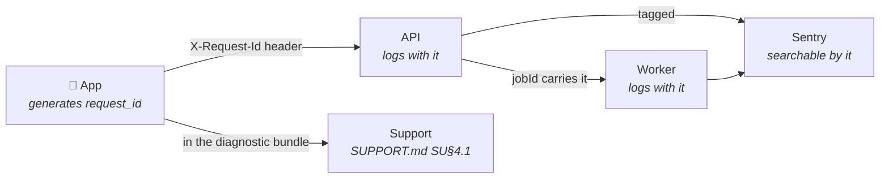

# OBSERVABILITY.md — CoachOS

> **What we record, what we watch, what wakes someone up, and what they do when it does.**
>
> `.claude/plan/phase-02-api-foundation/observability/` builds the *primitives* — structured
> logging, Sentry, the `audit_log` writer, health endpoints. This file owns the layer above
> them: correlation across tiers, the metrics that have thresholds, the short list of things
> that page, and a runbook per alert.
>
> **The constraint that shapes all of it:** `SUPPORT.md` says we cannot read a user's
> content. Our logs cannot either. Everything here is IDs, codes, counts, and durations —
> never a payload. That is a design constraint on logging, not a review step afterwards.

---

## OB§0. The four jobs

Observability is not "log everything." It is four distinct jobs, each answering a question
you cannot answer any other way.

| # | Job | Question it answers | Built in |
|---|---|---|---|
| **1** | **Correlated tracing** | "What actually happened during this one user's action?" | OB§2 |
| **2** | **Metrics with thresholds** | "Is the system healthy right now?" | OB§3 |
| **3** | **Alerts** | "Does a human need to act, now?" | OB§4 |
| **4** | **Runbooks** | "What do I do about it at 3am?" | OB§5 |

Build them in that order. Metrics with no correlation give you a number you cannot
investigate. Alerts with no runbook give you a panic with no plan.

---

## OB§1. What we log, and what we never log

### OB§1.1 The permitted field set

Every log line is structured JSON. Fields are **allowlisted**, never redacted — the same rule
as `SUPPORT.md`'s projections, and for the same reason: a redaction list silently starts
leaking the day someone adds a field.

| Field | Always | Notes |
|---|---|---|
| `request_id` | ✓ | The correlation key. See OB§2. |
| `ts`, `level`, `msg` | ✓ | `msg` is a **fixed string**, never interpolated with values |
| `user_id`, `role` | Where authenticated | IDs only |
| `procedure` / `route` | ✓ | e.g. `workouts.logSet` |
| `duration_ms`, `status` | ✓ | |
| `error_code` | On failure | From `ERRORS.md`. **Never a message, never a stack.** |
| `job_id`, `queue`, `attempt` | Worker lines | |
| `app_version`, `platform` | Client-originated | |
| `count`, `bytes`, `depth` | Where meaningful | Magnitudes, never contents |

### OB§1.2 Never in a log line

Not at `debug`. Not behind a flag. Not temporarily while debugging a production issue.

- Message, comment, note, or check-in text
- Food names, barcodes, meal contents
- Weights, body metrics, or any health value
- Names, emails, phone numbers, guardian emails
- Media URLs, R2 keys, filenames, signed URLs
- Outbox **payloads** (procedure names only — the same rule as the diagnostic bundle)
- Tokens, password hashes, webhook signatures
- Raw database error messages (they contain row values — log the code)

> **The interpolation trap.** `logger.info(\`logged set ${weight}kg for ${name}\`)` puts two
> forbidden values into a "safe" message string. Messages are fixed; values go in typed
> fields that the allowlist governs. Enforce it with a linter rule against template literals
> in log calls.

### OB§1.3 Retention and levels

| Level | Use | Retention |
|---|---|---|
| `error` | Something failed that shouldn't | 30 days |
| `warn` | Degraded but handled — retry, fallback, cache miss storm | 14 days |
| `info` | One line per request, one per job | 7 days |
| `debug` | Off in production. Enabled per-request via a header, by an operator, audited. | Not persisted |

Seven days of `info` is enough to investigate anything a user reports within a week, which
is the realistic window. Longer retention is a cost with no reader.

---

## OB§2. Correlation — the highest-value item

**One ID follows a user action across every tier.** Without it, "my workout didn't sync" is
three unrelated log streams and a guess.



**Rules**

1. **The device generates it**, not the server — a request that never arrives still has an ID
   the user can quote, which is exactly the case you most need to investigate.
2. It travels as `X-Request-Id`, is attached to every log line in that request's context, and
   is **carried into any job the request enqueues** so worker output is traceable back to the
   action that caused it.
3. It is a Sentry tag, so a crash and its server-side cause are one search apart.
4. It appears in the diagnostic bundle (`SUPPORT.md` SU§4.1) and in user-facing error copy for
   `UNEXPECTED` and `SERVER_UNAVAILABLE` only — enough for support, not enough to be noise.
5. **The outbox reuses one request ID across retries** of the same mutation. Ten flush
   attempts of one logged set are one story, not ten.

> This is the single change that most reduces time-to-diagnosis, and it is nearly free if
> done at the start. Retrofitting it means touching every log call site.

---

## OB§3. Metrics

The numbers where a **change** means act. Everything else is a dashboard nobody reads.

### OB§3.1 Integrity — watch these first

Failures here corrupt data rather than interrupt service. They are the
`ARCHITECTURE-ESSENTIALS.md` E§1 class.

| Metric | Source | Healthy | Act at |
|---|---|---|---|
| Outbox **permanent** failure rate | `sync_failed` (`ANALYTICS.md` AN§3.8) | ~0 | **Any sustained non-zero** |
| Duplicate-detection rate on upsert | API counter | Low and steady | A **step change** — means an idempotency key changed shape |
| `SYNC_CONFLICT` rate | Error counter | Rare | A spike — usually a conflict rule regression |
| Sessions per client per day > 1 for the same program day | DB check | 0 | **Any occurrence** — the two-device bug (DB§14.5) |
| Referential integrity (pass 3) | `exercise-reconcile` | 0 findings | Any finding |

### OB§3.2 Service health

| Metric | Healthy | Act at |
|---|---|---|
| API p95 by route | Within §19 budgets | 2× budget for 10 min |
| `UNEXPECTED` error rate | Trending to zero | Any spike, or any new code path producing it |
| DB connection pool utilisation | < 70% | > 85% (E§30) |
| Redis availability | Up | Down — degradation is graceful but rate limits fail closed on auth |
| Transcode queue depth **and oldest job age** | Draining | Age > 15 min |
| Dead-letter queue depth | 0 | Any non-zero |
| Webhook processing lag | < 1 min | > 10 min (billing correctness, E§4) |

> **Queue *age*, not just depth.** A queue of 500 fast jobs is fine; a queue of 3 jobs where
> the oldest is 40 minutes old is stuck. Depth alone hides the failure that matters.

### OB§3.3 Commitments we published

These have thresholds because we made a promise in a store listing or a legal document.

| Metric | Commitment | Alert |
|---|---|---|
| Oldest pending report age | 24h triage (`SUPPORT.md` SU§6) | **18h**, escalate 22h |
| Appeal age | 7 days | 5 days |
| Data-rights request age | 30 days (DPDP/GDPR) | 21 days |
| Support response by tier | 24h / 48h (§15.2) | 75% of the window |

### OB§3.4 Product health

Not alerted. Reviewed weekly, on a dashboard.

North star (weekly reviewed client-weeks), loop completion, feedback latency, annotation
rate, coach D7 retention, time-to-first-feedback. All defined in `ANALYTICS.md` AN§4.

---

## OB§4. Alerts

**The list is short on purpose.** Every alert must be actionable at 3am by one person with a
laptop. An alert nobody can act on trains you to ignore the ones you can.

### OB§4.1 Page immediately

| # | Alert | Why it pages |
|---|---|---|
| **P1** | Any integrity metric (OB§3.1) non-zero | Corrupts data; every minute makes it worse |
| **P2** | API unreachable, or error rate > 25% for 5 min | The product is down |
| **P3** | Database unreachable | Everything is down and the clock on recovery has started |
| **P4** | Oldest pending report > 18h | A published safety commitment is about to break |
| **P5** | Any report of a user seeing another user's data | Treated as a live breach (`SUPPORT.md` SU§7) |

**Five.** If a sixth is proposed, something on this list should probably come off.

### OB§4.2 Notify — next working session

Transcode backlog age > 15 min · dead-letter depth non-zero · webhook lag > 10 min ·
`UNEXPECTED` spike · pool utilisation > 85% · storage or event budget crossing 80% of a free
tier · appeal or data-rights age crossing its threshold · certificate or API key within 14
days of expiry.

### OB§4.3 Never alert

Individual 4xx errors · a single crash · rate-limit rejections · a single failed job with
retries remaining · anything with no defined action.

### OB§4.4 During the pilot

`docs/PILOT-PLAYBOOK.md` PI§4.1 tightens this temporarily: **any** crash affecting a pilot
user, and **any** `sync_failed`, is same-day. Ten coaches means the volume is manageable and
the cost of a missed bug is a coach walking away. Relax it after the gate.

---

## OB§5. Runbooks

One page per P1 alert. Written calm, read panicking. Each answers: what it means, what to
check first, what to do, and **what not to do**.

`docs/runbooks/` — one file per alert ID.

### OB§5.1 The required shape

```
# P{n} — {alert name}
## What this means          (one paragraph, no jargon)
## First three checks       (in order, with the exact command or dashboard)
## Likely causes            (ranked by frequency, not severity)
## What to do               (numbered, safe to follow half-asleep)
## What NOT to do           (the tempting action that makes it worse)
## Escalation               (when to stop and get help)
## Last exercised           (date — see OB§5.3)
```

### OB§5.2 The five

| Runbook | The "what not to do" that earns its place |
|---|---|
| **P1 — Data integrity** | **Do not delete the duplicate rows.** Snapshot first. You cannot tell which was the retry, and deleting destroys the evidence of how it happened. Stop writes to the affected path before investigating. |
| **P2 — API down / error storm** | Do not roll forward with a fix. **Roll back first**, diagnose second. |
| **P3 — Database unreachable** | Do not restore from backup until you have confirmed the primary is genuinely gone. A restore over a recoverable database loses everything written since the snapshot. |
| **P4 — Report SLA** | Do not bulk-dismiss to clear the queue. A dismissal requires a reason (`reporting/03`) and a wrong one is worse than a late one. |
| **P5 — Suspected data leak** | **Do not touch the account.** Preserve logs and `audit_log` first. Do not tell the reporter it was "probably a display bug" before you know. Follow `COMPLIANCE.md` CO§6's breach process — the clock is legal, not operational. |

### OB§5.3 Exercise them

A runbook never followed is fiction. **Once per quarter, pick one and walk it** against
staging — including P3, which means an actual restore (`ARCHITECTURE-ESSENTIALS.md` E§37e).
Record the date in the runbook's own footer. An unexercised runbook older than six months is
treated as untrusted.

---

## OB§6. Tooling, and the cost ceiling

Phase 1 is a **$0/month** budget (`CLAUDE.md` §3.4.2), and observability is where that gets
tested — every vendor in this space is priced per volume.

| Need | Phase 1 | When outgrown |
|---|---|---|
| Error tracking | **Sentry free** — 5k errors/mo. Sample aggressively; alert on *rate*, not every event. | Sample harder before paying |
| Logs | **Fly.io's own log stream**, plus structured JSON to stdout | A cheap log sink on the same VPS. Do not buy a log product. |
| Metrics | **Derived from logs and DB queries**, on a schedule. Not a metrics vendor. | Prometheus on the same box |
| Product analytics | **PostHog free** — 1M events/mo (`ANALYTICS.md` AN§6) | Cut low-value events first |
| Alerting | A **cron job that emails and pushes**. Five alerts do not need a platform. | PagerDuty only when there is someone to page other than Ammar |
| Uptime | A free external pinger against `/health` | — |

**The rule:** at this scale you need five alerts and a searchable log, not an observability
platform. Buying one converts a $0 line item into a $50 one and answers no question you
could not answer with a `WHERE` clause.

---

## OB§7. What this needs that the plan doesn't yet build

`.claude/plan/phase-02-api-foundation/observability/` builds tasks 01–04: structured logging,
Sentry, the `audit_log` writer, and health endpoints. Two tasks were added for this file:

| Task | Delivers |
|---|---|
| `phase-02-api-foundation/observability/05-request-correlation.md` | OB§2 end to end — device-generated IDs through API, jobs, and Sentry |
| `phase-02-api-foundation/observability/06-metrics-and-alerts.md` | OB§3's metrics, OB§4's five alerts, and the runbook skeletons |

---

*Companions: `ARCHITECTURE.md` A§12 (failure modes) · `ARCHITECTURE-ESSENTIALS.md` E§37
(cross-cutting) · `ERRORS.md` (the codes you'll see in logs) · `SUPPORT.md` (who reads them) ·
`ANALYTICS.md` (the other event stream, and why it is not this one) ·
Owner: Ammar · Last updated: 16 August 2026*
