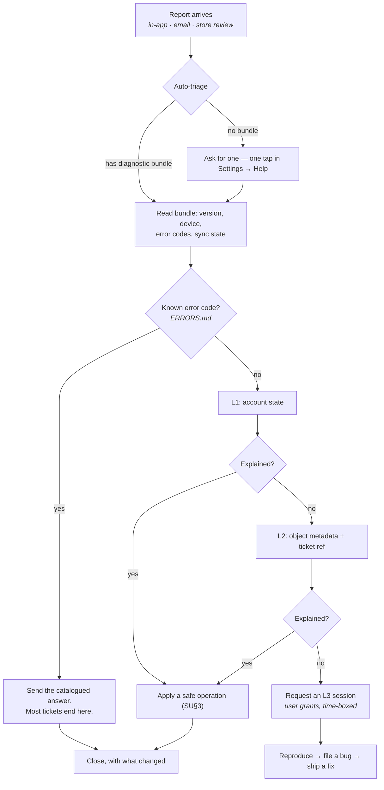

# SUPPORT.md — CoachOS

> **How we help a user whose data we are not allowed to look at.**
>
> This is the operational counterpart to `ERRORS.md`. That file names what went wrong; this
> one says who picks up the phone, what they are permitted to see, and how they fix it
> without reading a client's progress photos or food diary.
>
> **The constraint that shapes everything here:** `CLAUDE.md` §21.1 classifies progress
> photos, body metrics, injuries, food logs, messages, and form-check video as sensitive or
> highest-sensitivity data. Support has no exemption from that. A support tool that can read
> a client's data is a breach waiting for a bad hire, and under DPDP/GDPR it is a
> disclosure we have not obtained consent for.

---

## SU§0. The four principles

**1. Metadata, never content.** Support can see that a message exists, when it was sent, and
whether it synced. Support can never see what it says. The same for meals, check-in answers,
notes, and every photo.

**2. Every look is logged.** Any support read of a specific user's account writes to
`audit_log` with the operator, the target, the reason, and the ticket ID. Not "should" —
the tool has no unaudited read path.

**3. The user can grant more, temporarily.** When metadata is not enough, the user
themselves can open a time-boxed support session that widens what we can see. They grant it,
they see it granted, and it expires on its own.

**4. Most problems are answerable without touching the account at all.** Version, error
code, and a screenshot resolve the majority. Reach for the account only when they don't.

---

## SU§1. Tiers of access

Four levels. **Each one requires a stronger justification than the last, and the tool
enforces that ordering — it is not a matter of restraint.**

| Level | What it shows | Who | Consent needed |
|---|---|---|---|
| **L0 — Anonymous** | Aggregate health: error rates, queue depth, transcode backlog, version distribution. No user is identifiable. | Anyone on the team | None |
| **L1 — Account state** | For one user, by email or ID: role, tier, subscription status, seat count, storage used, device/OS/app version, last sync time, outbox depth, count of failed jobs. **Counts and states only.** | Support operator | None. Logged. |
| **L2 — Object metadata** | For one object: its ID, type, timestamps, status, size, sync state, error code, and which job touched it. Still no content, no filenames, no signed URLs. | Support operator, with a ticket reference | None. Logged with reason. |
| **L3 — User-granted session** | What the user chooses to share, for a bounded window: a specific screen, a specific conversation, or a diagnostic bundle they review before sending. | Ammar, or a named operator | **Explicit, in-app, time-boxed, revocable.** Logged both sides. |

**There is no L4.** There is no break-glass, no admin impersonation, no "view as user". If a
problem cannot be solved at L3, it is solved by shipping a fix, not by looking harder.

### SU§1.1 What is never visible at any level

Not to support, not to Ammar, not with a ticket, not with a court order absent proper
process:

- Progress photo bytes, thumbnails, dimensions, or signed URLs
- Message, comment, and coach-note text
- Check-in free-text answers
- Food names, meal contents, and barcodes
- Body metric values (weight, body fat, circumferences)
- Injury notes
- Form-check video frames
- Any health value from any source

Support can see that a progress photo **exists** and that it **failed to upload**. That is
enough to fix an upload bug and is the boundary.

---

## SU§2. The admin surface

There is one, it is small, and it is deliberately boring.

| | |
|---|---|
| **What it is** | A route group in the existing Next.js web app (`apps/web`), not a separate product |
| **Who reaches it** | Users with an `internal_operator` flag, behind the same Better Auth session plus a second factor |
| **What it can do** | Read L0–L2. Trigger a small set of **safe operations** (SU§3). Nothing else. |
| **What it cannot do** | Read any content in SU§1.1. Edit user data. Impersonate. Delete. Issue refunds directly. |
| **Where it's built** | `.claude/plan/phase-26-trust-and-safety/support-tooling/` |

**Why it lives in `apps/web` and not a new app:** it shares auth, deploy, and the tRPC
client, and a separate admin app is a second attack surface with a second set of
dependencies for a two-person team to patch. The isolation that matters is the
authorisation boundary, not the hostname.

**Every admin procedure goes through `ownsResource`'s sibling, `isOperator`**, and every one
of them is in the authorisation enumeration test with an explicit allowlist entry stating
why an operator may call it.

---

## SU§3. Safe operations

The complete list of actions support can take. Each is idempotent, reversible or harmless,
and audited.

| Operation | Why it exists | Risk if abused |
|---|---|---|
| **Force entitlement reconciliation** | The single most common billing fix — a dropped webhook (`ARCHITECTURE-ESSENTIALS.md` E§5) | None. It re-reads RevenueCat. |
| **Re-enqueue a failed job** by job ID | Stuck transcode, stuck notification fanout | None. Jobs are idempotent. |
| **Resend an invite email** | Typo'd or lost invite | Low. Rate-limited. |
| **Resend a verification or password-reset email** | Standard | Low. Rate-limited. |
| **Clear a stuck session claim** | A client's session locked to a dead device (`SESSION_CLAIMED_ELSEWHERE`) | Low. The user could do it themselves; this is for when they can't. |
| **Extend a grace period** by up to 14 days | A genuine payment problem we don't want to punish | Revenue only. Capped and logged. |
| **Suspend or reinstate an account** | Trust & safety outcome (SU§5) | High — so it requires two operators once the team is larger than one, and always writes a reason. |
| **Trigger a user's own data export** | The user asks; we make it happen | None. It goes to *their* email, never ours. |

**Not on this list, permanently:** editing a workout, deleting a comment on a user's behalf
(outside a T&S action), changing a subscription tier by hand, or "just having a look."

---

## SU§4. The support flow

### SU§4.1 The diagnostic bundle

The thing that makes L1–L3 rarely necessary. **One tap in Settings → Help → "Send diagnostic
info"**, with the contents shown to the user before sending.

**Contains:** app version, build number, OS version, device model, locale, timezone, network
type, role, tier, last sync timestamp, outbox depth, count of failed outbox items and their
**procedure names** (not payloads), the last 20 error *codes* with timestamps, storage used,
and the Sentry session ID.

**Never contains:** any payload, any content, any ID belonging to another user, any token,
any URL.

It is generated on-device, shown in full, and sent only when the user taps send. That last
property is what makes it consent rather than telemetry.

---

## SU§5. Trust & safety escalations

A report about a *person* is not a support ticket and does not follow SU§4.

| | |
|---|---|
| **Intake** | The in-app report flow (`phase-26-trust-and-safety/reporting/`) |
| **SLA** | **Triaged within 24 hours**, per the commitment published in the App Store listing and Terms |
| **Who** | Ammar, until there is someone else. This is not delegable to a contractor without training. |
| **What is visible** | **Only the reported content itself**, and only after a report exists. A report is the consent event. It is shown in a dedicated review view, logged, and never browsable. |
| **Outcomes** | No action · warning · content removal · suspension · permanent ban · law-enforcement referral |
| **Appeal** | Every enforcement email carries an appeal address. Appeals are answered by a human within 7 days. |

**The rule that keeps this honest:** the reviewer sees the reported item and its immediate
context — not the reporter's account, not the reported user's other conversations, not their
photos. Reviewing a report is not a licence to read a relationship.

Full spec, including the schema and the 24-hour commitment:
`.claude/plan/phase-26-trust-and-safety/`.

---

## SU§6. Channels and expectations

| Tier | Channel | Response commitment | Source |
|---|---|---|---|
| Starter | Community only | Best effort | `CLAUDE.md` §15.2 |
| Coach | Email | Best effort | §15.2 |
| Pro | Email | 48 hours | §15.2 |
| Studio | Priority email | 24 hours | §15.2 |
| Agency | Dedicated | Per contract | §15.2 |
| **Any tier — safety report** | In-app report | **24 hours** | Store requirement, SU§5 |
| **Any tier — data rights request** | Email + in-app | **30 days** (DPDP/GDPR) | §21.3 |

Safety and data-rights requests **ignore the tier table**. A Starter coach's abuse report is
triaged in 24 hours exactly like an Agency one. Gating safety behind a paid plan is
indefensible and, in several jurisdictions, unlawful.

---

## SU§7. Escalation to engineering

| Signal | Action |
|---|---|
| Same error code from 3+ users in 24h | File a bug, tag the release |
| Any `UNEXPECTED` (`ERRORS.md` ER§1.11) | Always a bug. Name the state, add a catalogue row. |
| A data-integrity report (wrong numbers, missing sets, duplicate workouts) | **Stop and page.** This is the E§1 class of failure and it is not a support ticket. |
| Any report of seeing another user's data | **Immediate.** Treat as a live breach until disproven: preserve logs, do not touch the account, follow the breach process in the DPDP work. |
| A store-review complaint | Reply publicly within 48h, then handle as a normal ticket |

The third and fourth rows are the ones that must never be triaged as ordinary tickets.

---

## SU§8. What we say when we cannot help

Sometimes the honest answer is that we cannot see what happened. Say so plainly:

> "I can see your app hit a sync error at 19:42 and retried successfully at 19:58, but I
> can't see the contents of your sessions — we deliberately don't have access to client
> training data. If you can tell me what looked wrong, I can check whether it's a bug on
> our side."

This is a feature, and saying it out loud builds more trust than a vague apology. Never
imply we could look if we wanted to.

---

*Companions: `ERRORS.md` · `CLAUDE.md` §21 · `.claude/plan/phase-26-trust-and-safety/` ·
Owner: Ammar · Last updated: 16 August 2026*
